# Wallet Transfer Service

A small Go service implementing wallet-to-wallet transfers with double-entry
ledger semantics, durable idempotency, and safe concurrency. See
[ASSIGNMENT.md](./ASSIGNMENT.md) for the full problem statement.

---

## Table of contents

- [Stack](#stack)
- [Project layout](#project-layout)
- [Architecture](#architecture)
  - [Layer responsibilities](#layer-responsibilities)
  - [Deployment topology](#deployment-topology)
  - [C4 model — context, container, component](#c4-model--context-container-component)
- [Database schema](#database-schema)
  - [Transfer write-path data flow](#transfer-write-path-data-flow)
- [Transfer state machine](#transfer-state-machine)
- [Request flows](#request-flows)
  - [Happy path](#happy-path-transfer)
  - [Idempotent replay (fast path)](#idempotent-replay-fast-path)
  - [Concurrent first-time insert (slow path)](#concurrent-first-time-insert-slow-path)
  - [Insufficient funds](#insufficient-funds)
  - [Lock ordering across concurrent transfers](#lock-ordering-across-concurrent-transfers)
  - [Request lifecycle (end-to-end)](#request-lifecycle-end-to-end)
- [Message Sequence Charts (formal)](#message-sequence-charts-formal)
  - [POST /transfers — every branch in one MSC](#post-transfers--every-branch-in-one-msc)
  - [Concurrent same-key race](#concurrent-same-key-race)
  - [Paginated wallet history (cursor walk)](#paginated-wallet-history-cursor-walk)
- [Design choices](#design-choices)
  - [1. Pessimistic locks + PK-as-mutex idempotency](#1-pessimistic-locks--pk-as-mutex-idempotency)
  - [2. stdlib net/http + database/sql](#2-stdlib-nethttp--databasesql-no-framework-no-orm)
  - [3. Single transaction per request](#3-single-transaction-per-request-not-saga--outbox)
  - [4. Testcontainers over sqlmock](#4-testcontainers-real-postgres-over-sqlmock)
  - [5. Transfer state machine](#5-transfer-state-machine-pending--terminal-in-the-same-tx)
  - [6. Middleware chain](#6-middleware-chain--observability--safety-net)
- [Threat model / attack surface](#threat-model--attack-surface)
- [API reference](#api-reference)
- [Configuration](#configuration)
- [How to run](#how-to-run)
- [pprof](#pprof)
- [Observability — Prometheus metrics + OpenTelemetry tracing](#observability--prometheus-metrics--opentelemetry-tracing)
- [Concurrency and scale](#concurrency-and-scale)
- [How to test](#how-to-test)
- [Test coverage](#test-coverage)
- [Tradeoffs and assumptions](#tradeoffs-and-assumptions)
- [AI disclosure](#ai-disclosure)
- [Submission notes](#submission-notes)

---

## Stack

- Go 1.25+, standard library `net/http` (Go 1.22 method-aware `ServeMux`)
- PostgreSQL 16, `database/sql` with the `pgx` driver
- `golang-migrate` for schema migrations, embedded into the binary via
  `go:embed`
- `testcontainers-go` for integration tests against a real Postgres
- No web framework, no ORM

---

## Project layout

```
cmd/server/                  HTTP entrypoint
internal/
  config/                    env loading
  db/                        sql.DB setup + embedded migrations
    migrations/              copy of the SQL migrations (for go:embed)
  domain/                    pure entities, state machine, errors
  repository/                interfaces shared by all backends
    postgres/                Postgres implementations + TxManager
  service/                   transfer + wallet business logic
  handler/                   thin HTTP handlers, JSON in/out, error mapping
  testdb/                    shared testcontainers Postgres for tests
migrations/                  source-of-truth SQL migrations
compose.yml                  Postgres for local development
Makefile                     db-up, run, test, test-int, lint, fmt-check
```

---

## Architecture

Strict layered architecture with one-way dependencies pointing inward
(handler → service → repository → DB). Domain types have no external
dependencies and can be referenced from any layer.

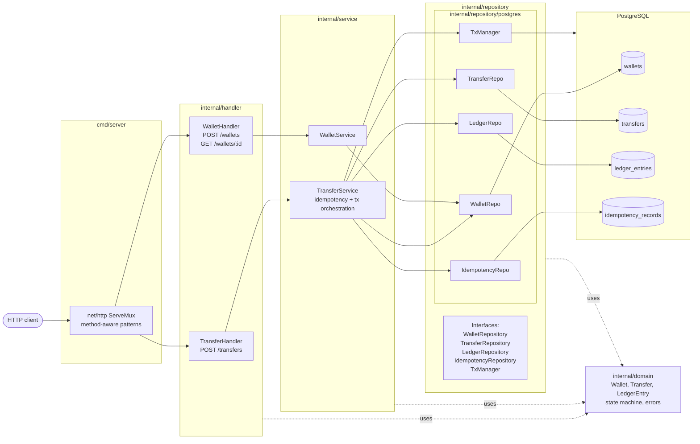
```mermaid
flowchart LR
    Client([HTTP client])

    subgraph Entry["cmd/server"]
        Mux["net/http ServeMux<br/>method-aware patterns"]
    end

    subgraph H["internal/handler"]
        TH["TransferHandler<br/>POST /transfers"]
        WH["WalletHandler<br/>POST /wallets<br/>GET /wallets/:id"]
    end

    subgraph S["internal/service"]
        TS["TransferService<br/>idempotency + tx orchestration"]
        WS["WalletService"]
    end

    subgraph R["internal/repository"]
        IF["Interfaces:<br/>WalletRepository<br/>TransferRepository<br/>LedgerRepository<br/>IdempotencyRepository<br/>TxManager"]
        subgraph PG["internal/repository/postgres"]
            PWR["WalletRepo"]
            PTR["TransferRepo"]
            PLR["LedgerRepo"]
            PIR["IdempotencyRepo"]
            PTX["TxManager"]
        end
    end

    subgraph DB["PostgreSQL"]
        W[(wallets)]
        T[(transfers)]
        L[(ledger_entries)]
        I[(idempotency_records)]
    end

    D["internal/domain<br/>Wallet, Transfer, LedgerEntry<br/>state machine, errors"]

    Client --> Mux
    Mux --> TH
    Mux --> WH
    TH --> TS
    WH --> WS
    TS --> PTX
    TS --> PWR
    TS --> PTR
    TS --> PLR
    TS --> PIR
    WS --> PWR
    PTX --> DB
    PWR --> W
    PTR --> T
    PLR --> L
    PIR --> I

    H -.uses.-> D
    S -.uses.-> D
    R -.uses.-> D
```

### Layer responsibilities

- **Handler** — request decoding, validation of the wire format, mapping
  domain errors to HTTP status codes. No business logic.
- **Service** — transaction boundaries, idempotency, locking strategy,
  state transitions. The only layer aware of the *workflow*.
- **Repository** — SQL only. Each method takes an `Executor` so it works
  identically inside or outside of a transaction.
- **Domain** — entities, enums, the transfer state machine, error
  sentinels. Has no imports from the other internal packages.

### Deployment topology

How the binary, the database, and operator tooling relate in a real
environment. Solid lines are normal traffic; dashed orange lines are
the loopback-only admin path.

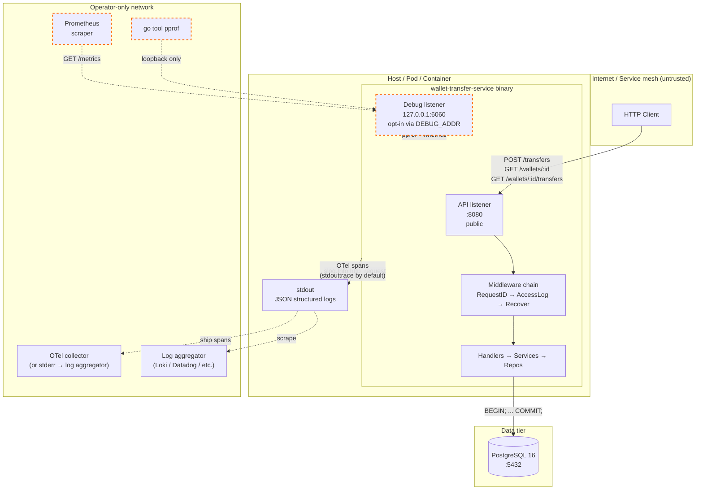
```mermaid
flowchart TB
    subgraph internet["Internet / Service mesh (untrusted)"]
        client[HTTP Client]
    end

    subgraph host["Host / Pod / Container"]
        subgraph process["wallet-transfer-service binary"]
            api["API listener<br/>:8080<br/>public"]
            debug["Debug listener<br/>127.0.0.1:6060<br/>opt-in via DEBUG_ADDR"]
            mw["Middleware chain<br/>RequestID → AccessLog → Recover"]
            biz["Handlers → Services → Repos"]
        end
        stdout["stdout<br/>JSON structured logs"]
    end

    subgraph data["Data tier"]
        pg[("PostgreSQL 16<br/>:5432")]
    end

    subgraph ops["Operator-only network"]
        pprof["go tool pprof"]
        prom["Prometheus<br/>scraper"]
        otel["OTel collector<br/>(or stderr → log aggregator)"]
        loki["Log aggregator<br/>(Loki / Datadog / etc.)"]
    end

    client -->|"POST /transfers<br/>GET /wallets/:id<br/>GET /wallets/:id/transfers"| api
    api --> mw --> biz
    biz -->|"BEGIN; ... COMMIT;"| pg

    pprof -. "loopback only" .-> debug
    prom -. "GET /metrics" .-> debug
    debug -. "pprof + /metrics" .-> process

    process -->|"slog.Info http_request"| stdout
    process -->|"OTel spans<br/>(stdouttrace by default)"| stdout
    stdout -. "scrape" .-> loki
    stdout -. "ship spans" .-> otel

    classDef admin stroke:#f60,stroke-width:2px,stroke-dasharray:5
    class debug,pprof,prom admin
```

**Key takeaways**

- The same Go process owns two listeners. The public one is reachable
  from anywhere the network allows; the debug one is loopback-default
  and never registers public routes (enforced by
  `cmd/server.TestRun_DebugListenerServesPprof`).
- The database is the only stateful component. Restarting the
  service is safe — graceful shutdown drains the listener for up
  to 10 seconds.
- Logs are stdout-first so any aggregator that reads container
  stdout (Loki, Datadog, CloudWatch, etc.) picks them up without
  extra wiring.

### C4 model — context, container, component

The [C4 model](https://c4model.com) gives three useful zoom levels:
**context** (who and what touches the system), **container**
(deployable / runnable units), and **component** (the parts inside a
container).

#### Context


```mermaid
graph TB
    user["Client App / SDK<br/>--<br/>Calls POST /transfers<br/>GET /wallets/&#123;id&#125;<br/>with idempotencyKey"]
    ops["Operator / SRE<br/>--<br/>Reads structured logs,<br/>captures pprof profiles,<br/>seeds wallets"]
    sys["wallet-transfer-service<br/>--<br/>Single Go binary<br/>that moves money<br/>between wallets"]
    pg[("PostgreSQL 16<br/>--<br/>Stores wallets,<br/>transfers, ledger,<br/>idempotency_records")]

    user -->|"HTTPS / JSON<br/>request_id correlation"| sys
    ops -. "DEBUG_ADDR opt-in<br/>(loopback only)" .-> sys
    sys -->|"BEGIN ... COMMIT<br/>FOR UPDATE locks"| pg
```

#### Container

The whole service is a single deployable unit (one binary, one image,
one pod). The "containers" here are the major packages inside the
process — the things a contributor opens in their editor and treats
as independent units of change.

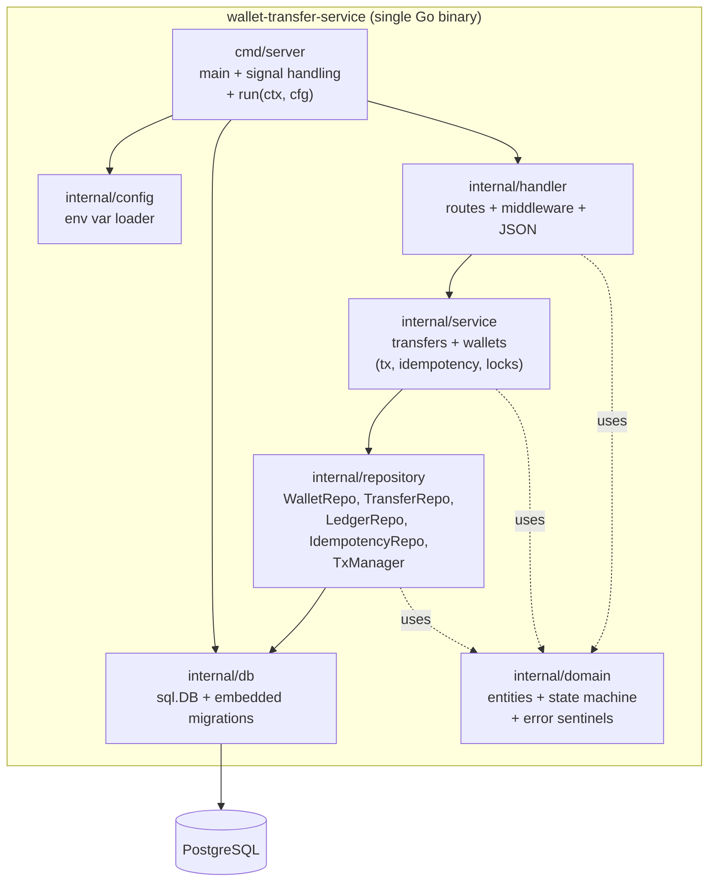
```mermaid
graph TB
    subgraph "wallet-transfer-service (single Go binary)"
        cmd["cmd/server<br/>main + signal handling<br/>+ run(ctx, cfg)"]
        cfg["internal/config<br/>env var loader"]
        dbpkg["internal/db<br/>sql.DB + embedded migrations"]
        handler["internal/handler<br/>routes + middleware + JSON"]
        service["internal/service<br/>transfers + wallets<br/>(tx, idempotency, locks)"]
        repo["internal/repository<br/>WalletRepo, TransferRepo,<br/>LedgerRepo, IdempotencyRepo,<br/>TxManager"]
        domain["internal/domain<br/>entities + state machine<br/>+ error sentinels"]
    end

    pg[("PostgreSQL")]

    cmd --> cfg
    cmd --> dbpkg
    cmd --> handler
    handler --> service
    service --> repo
    repo --> dbpkg
    dbpkg --> pg

    handler -.uses.-> domain
    service -.uses.-> domain
    repo -.uses.-> domain
```

#### Component (zoom into `internal/service`)

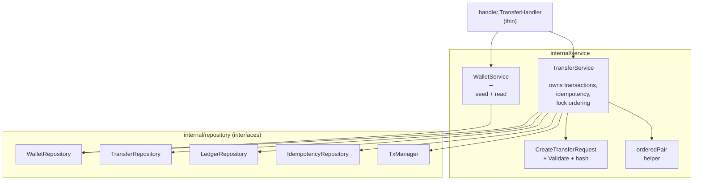
```mermaid
graph TB
    handler["handler.TransferHandler<br/>(thin)"]

    subgraph svc["internal/service"]
        ts["TransferService<br/>--<br/>owns transactions,<br/>idempotency,<br/>lock ordering"]
        ws["WalletService<br/>--<br/>seed + read"]
        ctr["CreateTransferRequest<br/>+ Validate + hash"]
        op["orderedPair<br/>helper"]
    end

    subgraph repo["internal/repository (interfaces)"]
        wri[WalletRepository]
        tri[TransferRepository]
        lri[LedgerRepository]
        iri[IdempotencyRepository]
        txm[TxManager]
    end

    handler --> ts
    handler --> ws
    ts --> ctr
    ts --> op
    ts --> wri
    ts --> tri
    ts --> lri
    ts --> iri
    ts --> txm
    ws --> wri
```

---

## Database schema

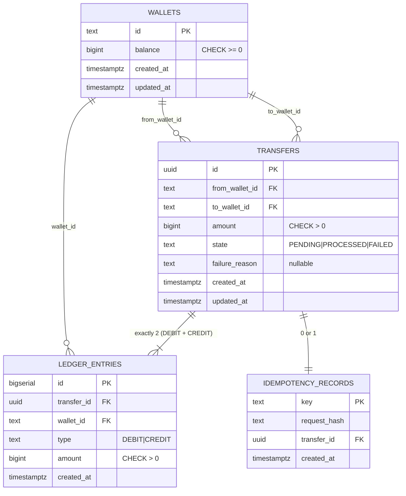
```mermaid
erDiagram
    WALLETS ||--o{ TRANSFERS : "from_wallet_id"
    WALLETS ||--o{ TRANSFERS : "to_wallet_id"
    WALLETS ||--o{ LEDGER_ENTRIES : "wallet_id"
    TRANSFERS ||--|{ LEDGER_ENTRIES : "exactly 2 (DEBIT + CREDIT)"
    TRANSFERS ||--|| IDEMPOTENCY_RECORDS : "0 or 1"

    WALLETS {
        text id PK
        bigint balance "CHECK >= 0"
        timestamptz created_at
        timestamptz updated_at
    }

    TRANSFERS {
        uuid id PK
        text from_wallet_id FK
        text to_wallet_id FK
        bigint amount "CHECK > 0"
        text state "PENDING|PROCESSED|FAILED"
        text failure_reason "nullable"
        timestamptz created_at
        timestamptz updated_at
    }

    LEDGER_ENTRIES {
        bigserial id PK
        uuid transfer_id FK
        text wallet_id FK
        text type "DEBIT|CREDIT"
        bigint amount "CHECK > 0"
        timestamptz created_at
    }

    IDEMPOTENCY_RECORDS {
        text key PK
        text request_hash
        uuid transfer_id FK
        timestamptz created_at
    }
```

### Constraints that do the heavy lifting

| Constraint                                                  | What it prevents                                       |
|-------------------------------------------------------------|--------------------------------------------------------|
| `wallets.balance CHECK (balance >= 0)`                      | Direct over-debit even if app logic has a bug          |
| `transfers.amount CHECK (amount > 0)`                       | Zero or negative transfers                             |
| `transfers CHECK (from_wallet_id <> to_wallet_id)`          | Self-transfers (which would inflate the ledger)        |
| `transfers.state CHECK (state IN (…))`                      | Invalid state values                                   |
| `ledger_entries UNIQUE (transfer_id, type)`                 | Two DEBITs or two CREDITs against the same transfer    |
| `ledger_entries.amount CHECK (amount > 0)`                  | Zero/negative ledger rows                              |
| `idempotency_records.key PRIMARY KEY`                       | Duplicate idempotency rows (this is the serialisation) |
| FK from ledger / idempotency → transfers                    | Orphan rows                                            |

### Indexes

- `transfers(from_wallet_id)` and `transfers(to_wallet_id)` — for transfer
  history per wallet.
- `ledger_entries(wallet_id)` — for ledger queries / balance reconstruction.
- All `UNIQUE` and `PRIMARY KEY` constraints provide their own indexes.

### Transfer write-path data flow

Which tables get touched in what order inside the `RunInTx` block, and
which schema constraints fire at each step. This is the layer most
exposed to financial-correctness bugs, so the constraints are pulled
out alongside each write.

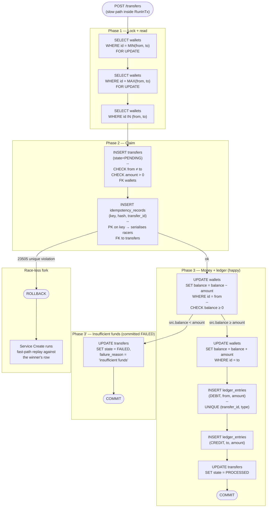
```mermaid
flowchart TB
    start(["POST /transfers<br/>(slow path inside RunInTx)"])

    subgraph locks["Phase 1 — Lock + read"]
        l1["SELECT wallets<br/>WHERE id = MIN(from, to)<br/>FOR UPDATE"]
        l2["SELECT wallets<br/>WHERE id = MAX(from, to)<br/>FOR UPDATE"]
        r["SELECT wallets<br/>WHERE id IN (from, to)"]
    end

    subgraph create["Phase 2 — Claim"]
        t1["INSERT transfers<br/>(state=PENDING)<br/>--<br/>CHECK from ≠ to<br/>CHECK amount > 0<br/>FK wallets"]
        i1["INSERT idempotency_records<br/>(key, hash, transfer_id)<br/>--<br/>PK on key → serialises racers<br/>FK to transfers"]
    end

    subgraph happy["Phase 3 — Money + ledger (happy)"]
        b1["UPDATE wallets<br/>SET balance = balance − amount<br/>WHERE id = from<br/>--<br/>CHECK balance ≥ 0"]
        b2["UPDATE wallets<br/>SET balance = balance + amount<br/>WHERE id = to"]
        e1["INSERT ledger_entries<br/>(DEBIT, from, amount)<br/>--<br/>UNIQUE (transfer_id, type)"]
        e2["INSERT ledger_entries<br/>(CREDIT, to, amount)"]
        t2["UPDATE transfers<br/>SET state = PROCESSED"]
        ok([COMMIT])
    end

    subgraph fail["Phase 3' — Insufficient funds (committed FAILED)"]
        tf["UPDATE transfers<br/>SET state = FAILED,<br/>failure_reason = 'insufficient funds'"]
        cf([COMMIT])
    end

    subgraph race["Race-loss fork"]
        rb([ROLLBACK])
        replay["Service Create runs<br/>fast-path replay against<br/>the winner's row"]
    end

    start --> l1 --> l2 --> r --> t1 --> i1
    i1 -->|"23505 unique violation"| rb --> replay
    i1 -->|"ok"| b1
    b1 -->|"src.balance < amount"| tf --> cf
    b1 -->|"src.balance ≥ amount"| b2 --> e1 --> e2 --> t2 --> ok
```

**Key takeaways**

- Locks are acquired BEFORE either INSERT, so no race can sneak in
  between the read and the write.
- The idempotency insert is the gatekeeper of exactly-once. The PK
  collision (23505) is the signal — there's no application-level
  lock to forget.
- The FAILED branch still ends in `COMMIT`. The transfer + idempotency
  row both persist so a retry of the same request returns the same
  FAILED outcome instead of trying again.

---

## Transfer state machine

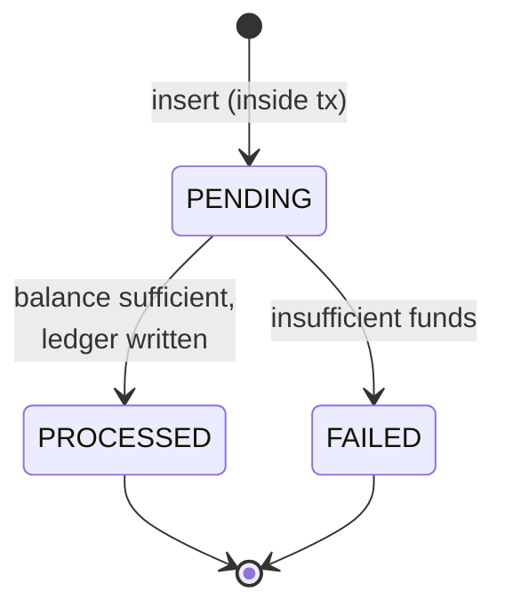
```mermaid
stateDiagram-v2
    [*] --> PENDING : insert (inside tx)
    PENDING --> PROCESSED : balance sufficient,<br/>ledger written
    PENDING --> FAILED : insufficient funds
    PROCESSED --> [*]
    FAILED --> [*]
```

- Both `PROCESSED` and `FAILED` are terminal.
- The same transaction that inserts the row also moves it to its terminal
  state. The intermediate `PENDING` write is kept so that an async or
  multi-step variant (queued processing, external settlement) can plug in
  later without schema changes.
- `domain.TransferState.CanTransitionTo` enforces the legal edges and is
  covered by unit tests.

---

## Request flows

### Happy path transfer

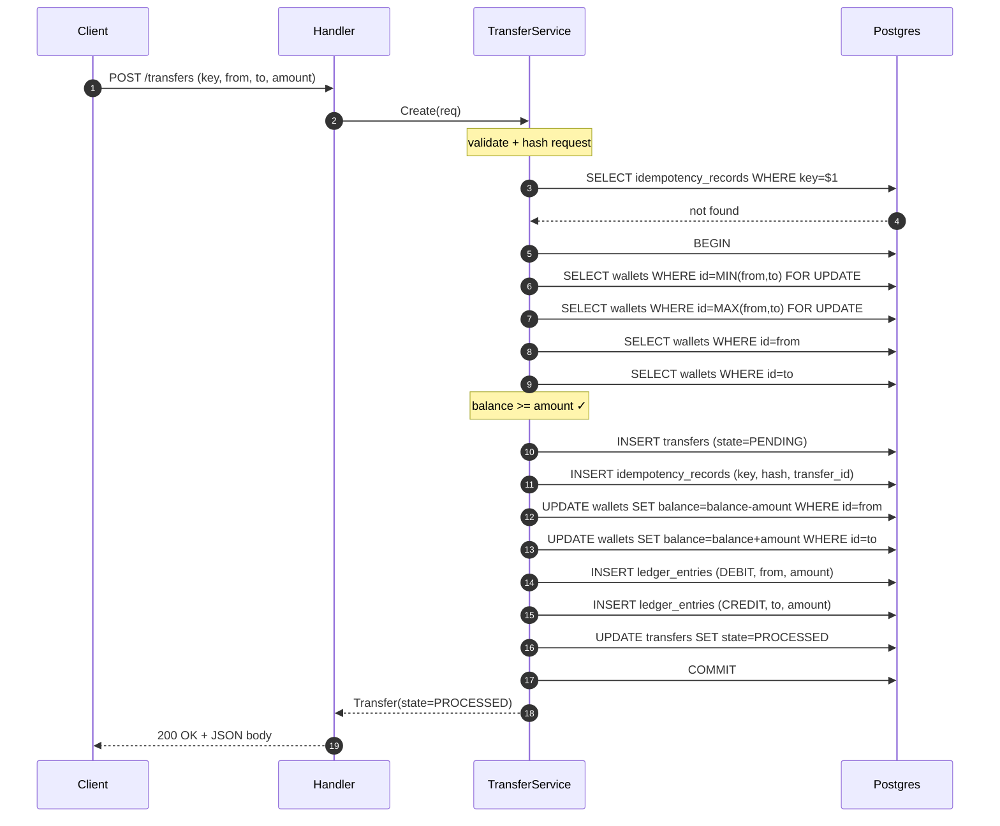
```mermaid
sequenceDiagram
    autonumber
    participant C as Client
    participant H as Handler
    participant S as TransferService
    participant DB as Postgres

    C->>H: POST /transfers (key, from, to, amount)
    H->>S: Create(req)
    Note over S: validate + hash request

    S->>DB: SELECT idempotency_records WHERE key=$1
    DB-->>S: not found

    S->>DB: BEGIN
    S->>DB: SELECT wallets WHERE id=MIN(from,to) FOR UPDATE
    S->>DB: SELECT wallets WHERE id=MAX(from,to) FOR UPDATE
    S->>DB: SELECT wallets WHERE id=from
    S->>DB: SELECT wallets WHERE id=to
    Note over S: balance >= amount ✓

    S->>DB: INSERT transfers (state=PENDING)
    S->>DB: INSERT idempotency_records (key, hash, transfer_id)
    S->>DB: UPDATE wallets SET balance=balance-amount WHERE id=from
    S->>DB: UPDATE wallets SET balance=balance+amount WHERE id=to
    S->>DB: INSERT ledger_entries (DEBIT, from, amount)
    S->>DB: INSERT ledger_entries (CREDIT, to, amount)
    S->>DB: UPDATE transfers SET state=PROCESSED
    S->>DB: COMMIT

    S-->>H: Transfer(state=PROCESSED)
    H-->>C: 200 OK + JSON body
```

### Idempotent replay (fast path)

Same idempotency key, same request body, original request already
committed. The fast path skips the transaction entirely.

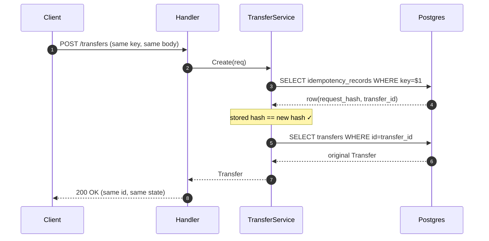
```mermaid
sequenceDiagram
    autonumber
    participant C as Client
    participant H as Handler
    participant S as TransferService
    participant DB as Postgres

    C->>H: POST /transfers (same key, same body)
    H->>S: Create(req)
    S->>DB: SELECT idempotency_records WHERE key=$1
    DB-->>S: row(request_hash, transfer_id)
    Note over S: stored hash == new hash ✓
    S->>DB: SELECT transfers WHERE id=transfer_id
    DB-->>S: original Transfer
    S-->>H: Transfer
    H-->>C: 200 OK (same id, same state)
```

If the stored `request_hash` differs from the new request, the service
returns `domain.ErrIdempotencyConflict` and the handler maps it to
`409 Conflict`.

### Concurrent first-time insert (slow path)

Two clients race with the same key. Only one transfer is created; the
loser falls back to the replay path automatically.

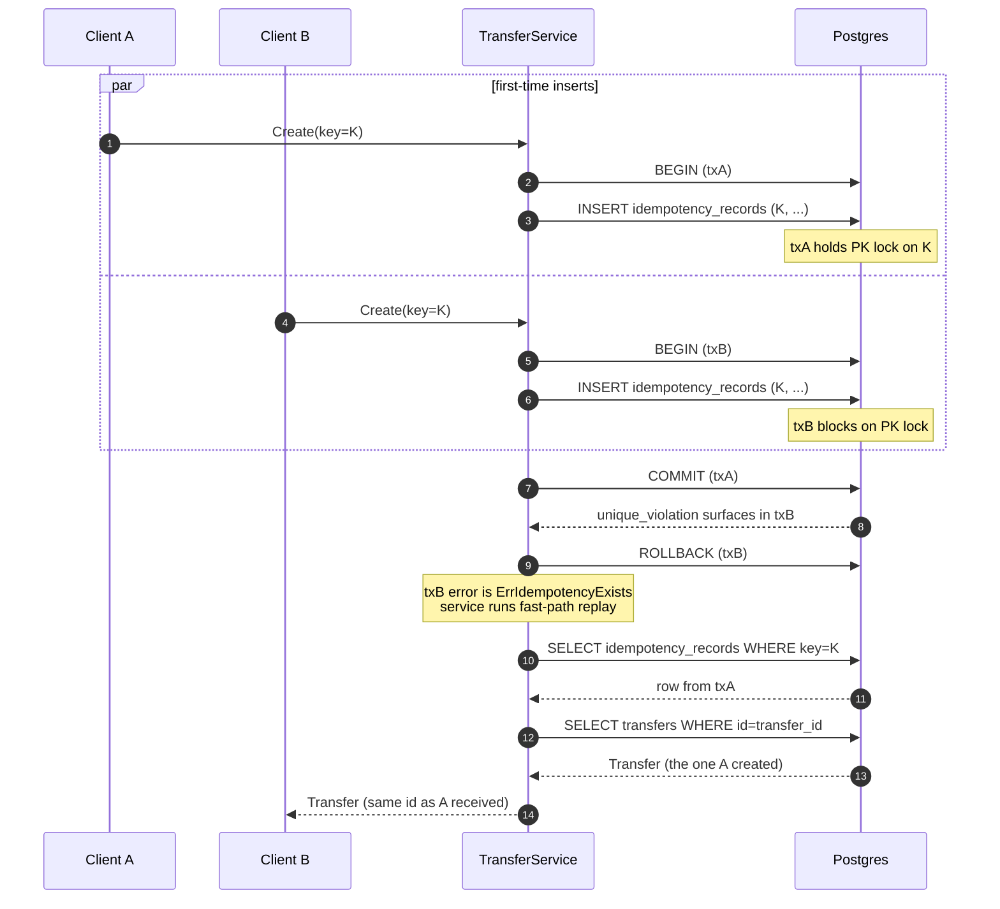
```mermaid
sequenceDiagram
    autonumber
    participant A as Client A
    participant B as Client B
    participant S as TransferService
    participant DB as Postgres

    par first-time inserts
        A->>S: Create(key=K)
        S->>DB: BEGIN (txA)
        S->>DB: INSERT idempotency_records (K, ...)
        Note over DB: txA holds PK lock on K
    and
        B->>S: Create(key=K)
        S->>DB: BEGIN (txB)
        S->>DB: INSERT idempotency_records (K, ...)
        Note over DB: txB blocks on PK lock
    end

    S->>DB: COMMIT (txA)
    DB-->>S: unique_violation surfaces in txB
    S->>DB: ROLLBACK (txB)

    Note over S: txB error is ErrIdempotencyExists<br/>service runs fast-path replay

    S->>DB: SELECT idempotency_records WHERE key=K
    DB-->>S: row from txA
    S->>DB: SELECT transfers WHERE id=transfer_id
    DB-->>S: Transfer (the one A created)
    S-->>B: Transfer (same id as A received)
```

### Insufficient funds

A `FAILED` outcome is also a normal committed result. Replays of the same
request return the same `FAILED` transfer without retrying the debit.

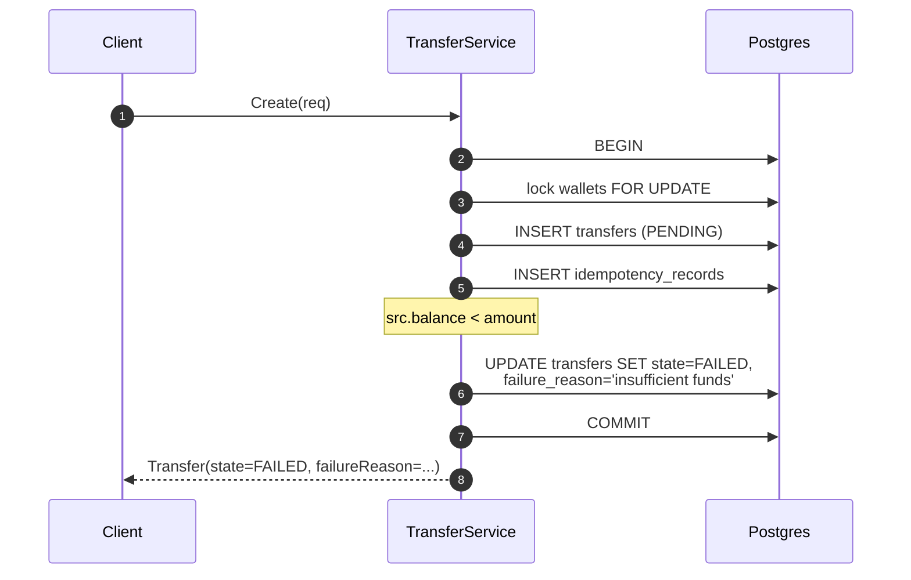
```mermaid
sequenceDiagram
    autonumber
    participant C as Client
    participant S as TransferService
    participant DB as Postgres

    C->>S: Create(req)
    S->>DB: BEGIN
    S->>DB: lock wallets FOR UPDATE
    S->>DB: INSERT transfers (PENDING)
    S->>DB: INSERT idempotency_records
    Note over S: src.balance < amount

    S->>DB: UPDATE transfers SET state=FAILED,<br/>failure_reason='insufficient funds'
    S->>DB: COMMIT
    S-->>C: Transfer(state=FAILED, failureReason=...)
```

No balance changes are persisted; no ledger entries are written; the
idempotency record IS committed so the same request key cannot retry.

### Lock ordering across concurrent transfers

If two concurrent transfers touch the same pair of wallets in opposite
directions (A→B and B→A), naive `SELECT ... FOR UPDATE` calls in
request-order would deadlock. The service always locks the lower-id wallet
first, so the locks acquire in the same order regardless of direction.

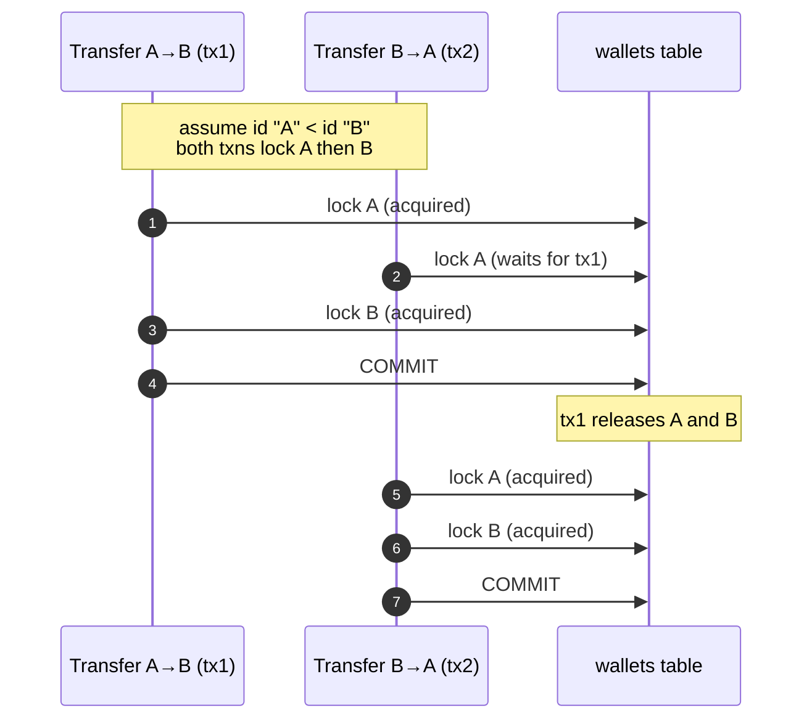
```mermaid
sequenceDiagram
    autonumber
    participant T1 as Transfer A→B (tx1)
    participant T2 as Transfer B→A (tx2)
    participant W as wallets table

    Note over T1,T2: assume id "A" < id "B"<br/>both txns lock A then B

    T1->>W: lock A (acquired)
    T2->>W: lock A (waits for tx1)
    T1->>W: lock B (acquired)
    T1->>W: COMMIT
    Note over W: tx1 releases A and B
    T2->>W: lock A (acquired)
    T2->>W: lock B (acquired)
    T2->>W: COMMIT
```

No deadlock — at the cost of serialising any two transfers that share a
wallet, which is exactly the contention we *want* serialised.

### Get a transfer by id

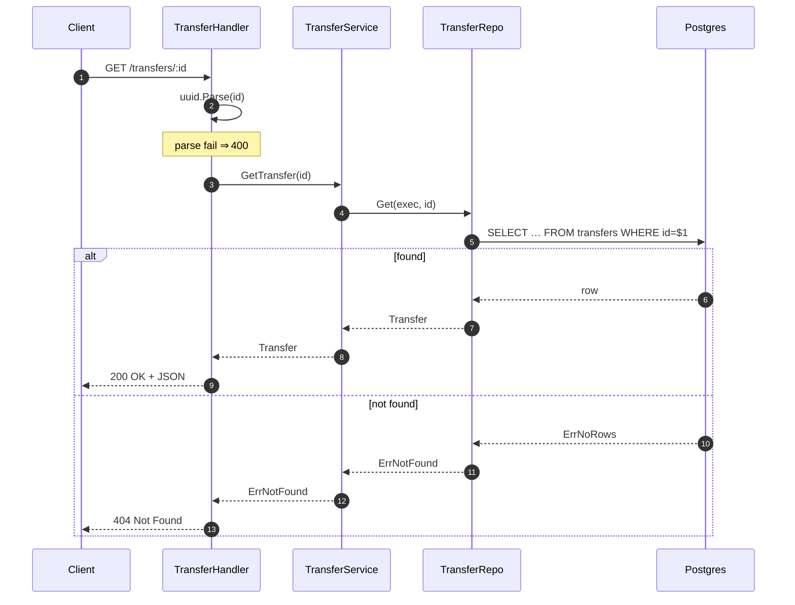
```mermaid
sequenceDiagram
    autonumber
    participant C as Client
    participant H as TransferHandler
    participant S as TransferService
    participant T as TransferRepo
    participant DB as Postgres

    C->>H: GET /transfers/:id
    H->>H: uuid.Parse(id)
    Note over H: parse fail ⇒ 400
    H->>S: GetTransfer(id)
    S->>T: Get(exec, id)
    T->>DB: SELECT … FROM transfers WHERE id=$1
    alt found
        DB-->>T: row
        T-->>S: Transfer
        S-->>H: Transfer
        H-->>C: 200 OK + JSON
    else not found
        DB-->>T: ErrNoRows
        T-->>S: ErrNotFound
        S-->>H: ErrNotFound
        H-->>C: 404 Not Found
    end
```

### Paginated wallet history

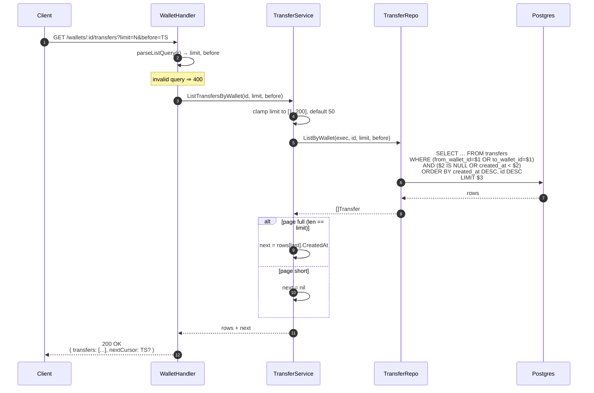
```mermaid
sequenceDiagram
    autonumber
    participant C as Client
    participant H as WalletHandler
    participant S as TransferService
    participant T as TransferRepo
    participant DB as Postgres

    C->>H: GET /wallets/:id/transfers?limit=N&before=TS
    H->>H: parseListQuery(r) → limit, before
    Note over H: invalid query ⇒ 400
    H->>S: ListTransfersByWallet(id, limit, before)
    S->>S: clamp limit to [1, 200], default 50
    S->>T: ListByWallet(exec, id, limit, before)
    T->>DB: SELECT … FROM transfers<br/>WHERE (from_wallet_id=$1 OR to_wallet_id=$1)<br/>AND ($2 IS NULL OR created_at < $2)<br/>ORDER BY created_at DESC, id DESC<br/>LIMIT $3
    DB-->>T: rows
    T-->>S: []Transfer
    alt page full (len == limit)
        S->>S: next = rows[last].CreatedAt
    else page short
        S->>S: next = nil
    end
    S-->>H: rows + next
    H-->>C: 200 OK<br/>( transfers: [...], nextCursor: TS? )
```

### Request lifecycle (end-to-end)

Every successful `POST /transfers` walks the same path. This diagram
ties together the middleware chain, the service flow, the SQL writes,
and the audit log emission into one picture. Use it as the canonical
"what happens when a request arrives" reference.

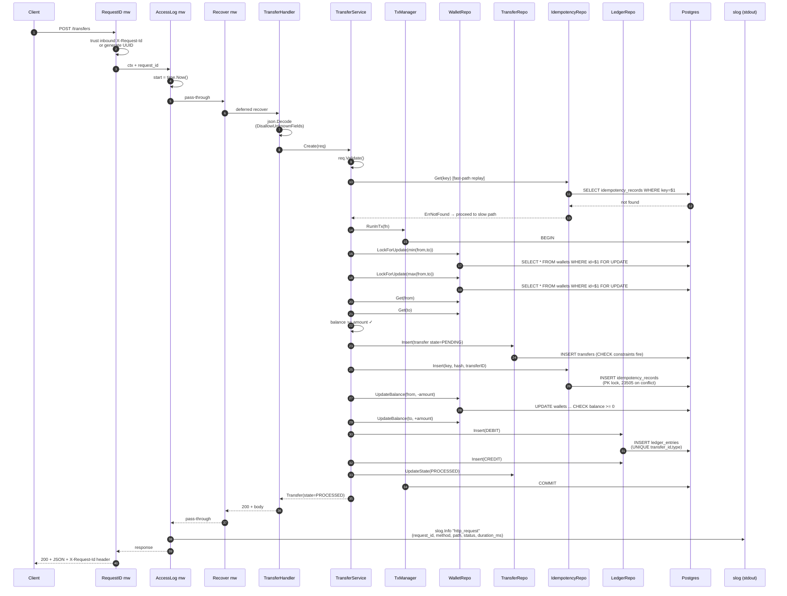
```mermaid
sequenceDiagram
    autonumber
    participant C as Client
    participant RID as RequestID mw
    participant ACL as AccessLog mw
    participant REC as Recover mw
    participant H as TransferHandler
    participant S as TransferService
    participant TXM as TxManager
    participant W as WalletRepo
    participant T as TransferRepo
    participant I as IdempotencyRepo
    participant L as LedgerRepo
    participant DB as Postgres
    participant LOG as slog (stdout)

    C->>RID: POST /transfers
    RID->>RID: trust inbound X-Request-Id<br/>or generate UUID
    RID->>ACL: ctx + request_id
    ACL->>ACL: start = time.Now()
    ACL->>REC: pass-through
    REC->>H: deferred recover

    H->>H: json.Decode<br/>(DisallowUnknownFields)
    H->>S: Create(req)

    S->>S: req.Validate()
    S->>I: Get(key) [fast-path replay]
    I->>DB: SELECT idempotency_records WHERE key=$1
    DB-->>I: not found
    I-->>S: ErrNotFound → proceed to slow path

    S->>TXM: RunInTx(fn)
    TXM->>DB: BEGIN

    S->>W: LockForUpdate(min(from,to))
    W->>DB: SELECT * FROM wallets WHERE id=$1 FOR UPDATE
    S->>W: LockForUpdate(max(from,to))
    W->>DB: SELECT * FROM wallets WHERE id=$1 FOR UPDATE

    S->>W: Get(from)
    S->>W: Get(to)
    S->>S: balance >= amount ✓

    S->>T: Insert(transfer state=PENDING)
    T->>DB: INSERT transfers (CHECK constraints fire)

    S->>I: Insert(key, hash, transferID)
    I->>DB: INSERT idempotency_records<br/>(PK lock, 23505 on conflict)

    S->>W: UpdateBalance(from, -amount)
    W->>DB: UPDATE wallets ... CHECK balance >= 0
    S->>W: UpdateBalance(to, +amount)

    S->>L: Insert(DEBIT)
    L->>DB: INSERT ledger_entries<br/>(UNIQUE transfer_id,type)
    S->>L: Insert(CREDIT)

    S->>T: UpdateState(PROCESSED)

    TXM->>DB: COMMIT
    S-->>H: Transfer(state=PROCESSED)
    H-->>REC: 200 + body
    REC-->>ACL: pass-through
    ACL->>LOG: slog.Info "http_request"<br/>(request_id, method, path, status, duration_ms)
    ACL-->>RID: response
    RID-->>C: 200 + JSON + X-Request-Id header
```

**Key takeaways**

- The `request_id` created by RequestID flows into every log line,
  so a single failed call can be traced end-to-end.
- Recover wraps the handler, so even a panic from the deepest
  repository call would produce a clean 500 with the request id in
  the panic-recovered log entry.
- The fast-path replay happens BEFORE any transaction is opened —
  duplicate requests don't acquire wallet locks, which keeps the
  hot path fast.

---

## Message Sequence Charts (formal)

The five sequence diagrams above each illustrate one scenario. The two
charts below take the *formal MSC* approach: each captures every
relevant branch in a single diagram using `alt`/`else` blocks, and a
separate one uses `par` to show two concurrent lifelines racing on
the same idempotency key. They are heavier to read but faithful to
the entire possibility space.

### POST /transfers — every branch in one MSC

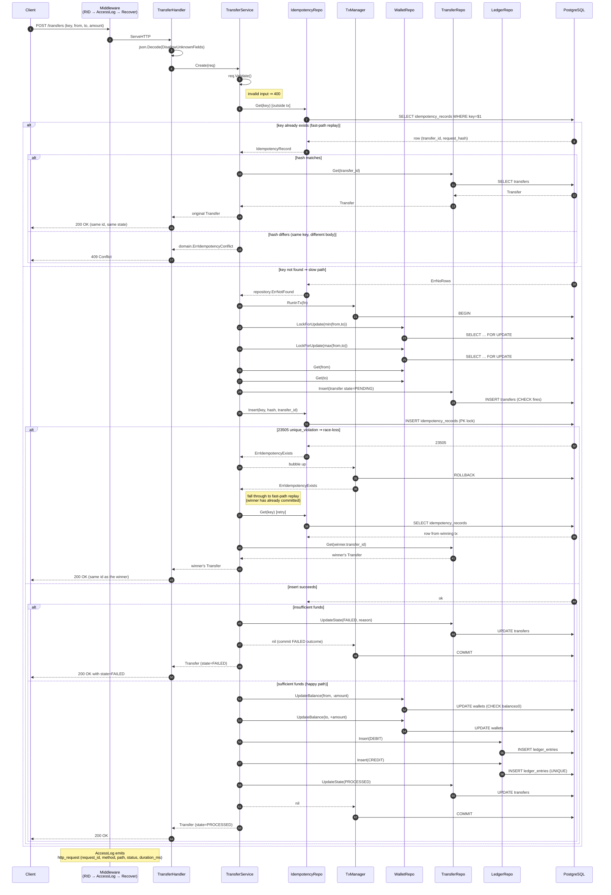
```mermaid
sequenceDiagram
    autonumber
    participant C as Client
    participant MW as Middleware<br/>(RID → AccessLog → Recover)
    participant H as TransferHandler
    participant S as TransferService
    participant I as IdempotencyRepo
    participant TXM as TxManager
    participant W as WalletRepo
    participant T as TransferRepo
    participant L as LedgerRepo
    participant DB as PostgreSQL

    C->>MW: POST /transfers (key, from, to, amount)
    MW->>H: ServeHTTP
    H->>H: json.Decode(DisallowUnknownFields)
    H->>S: Create(req)
    S->>S: req.Validate()
    Note right of S: invalid input ⇒ 400

    S->>I: Get(key) [outside tx]
    I->>DB: SELECT idempotency_records WHERE key=$1

    alt key already exists (fast-path replay)
        DB-->>I: row (transfer_id, request_hash)
        I-->>S: IdempotencyRecord
        alt hash matches
            S->>T: Get(transfer_id)
            T->>DB: SELECT transfers
            DB-->>T: Transfer
            T-->>S: Transfer
            S-->>H: original Transfer
            H-->>C: 200 OK (same id, same state)
        else hash differs (same key, different body)
            S-->>H: domain.ErrIdempotencyConflict
            H-->>C: 409 Conflict
        end
    else key not found ⇒ slow path
        DB-->>I: ErrNoRows
        I-->>S: repository.ErrNotFound

        S->>TXM: RunInTx(fn)
        TXM->>DB: BEGIN

        S->>W: LockForUpdate(min(from,to))
        W->>DB: SELECT … FOR UPDATE
        S->>W: LockForUpdate(max(from,to))
        W->>DB: SELECT … FOR UPDATE
        S->>W: Get(from)
        S->>W: Get(to)

        S->>T: Insert(transfer state=PENDING)
        T->>DB: INSERT transfers (CHECK fires)
        S->>I: Insert(key, hash, transfer_id)
        I->>DB: INSERT idempotency_records (PK lock)

        alt 23505 unique_violation ⇒ race-loss
            DB-->>I: 23505
            I-->>S: ErrIdempotencyExists
            S-->>TXM: bubble up
            TXM->>DB: ROLLBACK
            TXM-->>S: ErrIdempotencyExists
            Note right of S: fall through to fast-path replay<br/>(winner has already committed)
            S->>I: Get(key) [retry]
            I->>DB: SELECT idempotency_records
            DB-->>I: row from winning tx
            S->>T: Get(winner.transfer_id)
            T-->>S: winner's Transfer
            S-->>H: winner's Transfer
            H-->>C: 200 OK (same id as the winner)
        else insert succeeds
            DB-->>I: ok

            alt insufficient funds
                S->>T: UpdateState(FAILED, reason)
                T->>DB: UPDATE transfers
                S-->>TXM: nil (commit FAILED outcome)
                TXM->>DB: COMMIT
                S-->>H: Transfer (state=FAILED)
                H-->>C: 200 OK with state=FAILED
            else sufficient funds (happy path)
                S->>W: UpdateBalance(from, -amount)
                W->>DB: UPDATE wallets (CHECK balance≥0)
                S->>W: UpdateBalance(to, +amount)
                W->>DB: UPDATE wallets
                S->>L: Insert(DEBIT)
                L->>DB: INSERT ledger_entries
                S->>L: Insert(CREDIT)
                L->>DB: INSERT ledger_entries (UNIQUE)
                S->>T: UpdateState(PROCESSED)
                T->>DB: UPDATE transfers
                S-->>TXM: nil
                TXM->>DB: COMMIT
                S-->>H: Transfer (state=PROCESSED)
                H-->>C: 200 OK
            end
        end
    end

    Note over MW: AccessLog emits<br/>http_request (request_id, method, path, status, duration_ms)
```

**Key takeaways**

- The chart enumerates **five** possible terminal outcomes from a
  single endpoint:
  1. 200 OK + PROCESSED (happy path)
  2. 200 OK + FAILED (insufficient funds — still committed)
  3. 200 OK + cached PROCESSED/FAILED (fast-path replay)
  4. 200 OK + same id as winner (slow-path race-loss replay)
  5. 409 Conflict (same key + different body)
- Every "200 OK" terminal is a successful, committed outcome. The
  state field on the body is what tells the client whether the
  money moved; the HTTP status alone is not enough.

### Concurrent same-key race

Two HTTP requests arrive at the same time carrying the same
`idempotencyKey`. The chart shows how the database's PK serialises
them so only one transfer is created and both callers receive the
same response.

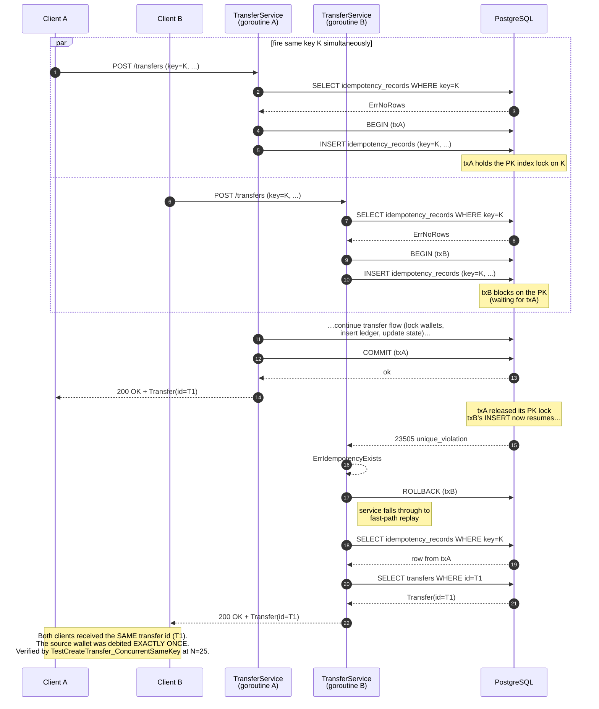
```mermaid
sequenceDiagram
    autonumber
    participant A as Client A
    participant B as Client B
    participant SA as TransferService<br/>(goroutine A)
    participant SB as TransferService<br/>(goroutine B)
    participant DB as PostgreSQL

    par fire same key K simultaneously
        A->>SA: POST /transfers (key=K, ...)
        SA->>DB: SELECT idempotency_records WHERE key=K
        DB-->>SA: ErrNoRows
        SA->>DB: BEGIN (txA)
        SA->>DB: INSERT idempotency_records (key=K, ...)
        Note over DB: txA holds the PK index lock on K
    and
        B->>SB: POST /transfers (key=K, ...)
        SB->>DB: SELECT idempotency_records WHERE key=K
        DB-->>SB: ErrNoRows
        SB->>DB: BEGIN (txB)
        SB->>DB: INSERT idempotency_records (key=K, ...)
        Note over DB: txB blocks on the PK<br/>(waiting for txA)
    end

    SA->>DB: …continue transfer flow (lock wallets,<br/>insert ledger, update state)…
    SA->>DB: COMMIT (txA)
    DB-->>SA: ok
    SA-->>A: 200 OK + Transfer(id=T1)

    Note over DB: txA released its PK lock<br/>txB's INSERT now resumes…
    DB-->>SB: 23505 unique_violation
    SB-->>SB: ErrIdempotencyExists
    SB->>DB: ROLLBACK (txB)

    Note right of SB: service falls through to<br/>fast-path replay
    SB->>DB: SELECT idempotency_records WHERE key=K
    DB-->>SB: row from txA
    SB->>DB: SELECT transfers WHERE id=T1
    DB-->>SB: Transfer(id=T1)
    SB-->>B: 200 OK + Transfer(id=T1)

    Note over A,B: Both clients received the SAME transfer id (T1).<br/>The source wallet was debited EXACTLY ONCE.<br/>Verified by TestCreateTransfer_ConcurrentSameKey at N=25.
```

**Key takeaways**

- The PK on `idempotency_records.key` is the entire serialisation
  primitive. No application-level mutex, no Redis lock, no
  distributed coordinator — Postgres does the work.
- The loser does NOT retry the transfer logic; it goes straight to
  the fast-path replay, so the loser pays only the cost of two
  SELECTs.
- The race window (between the SELECT and the INSERT) is tolerated
  by design: even if N goroutines all reach the INSERT
  simultaneously, exactly one wins; all others map their 23505 to
  `ErrIdempotencyExists` and replay against the winner.

### Paginated wallet history (cursor walk)

Shows the full client-side pagination dance for
`GET /wallets/{id}/transfers`. The client walks pages by feeding each
response's `nextCursor` into the next request's `before` query
parameter, stopping when the server omits the cursor (= "you have
reached the end of history").

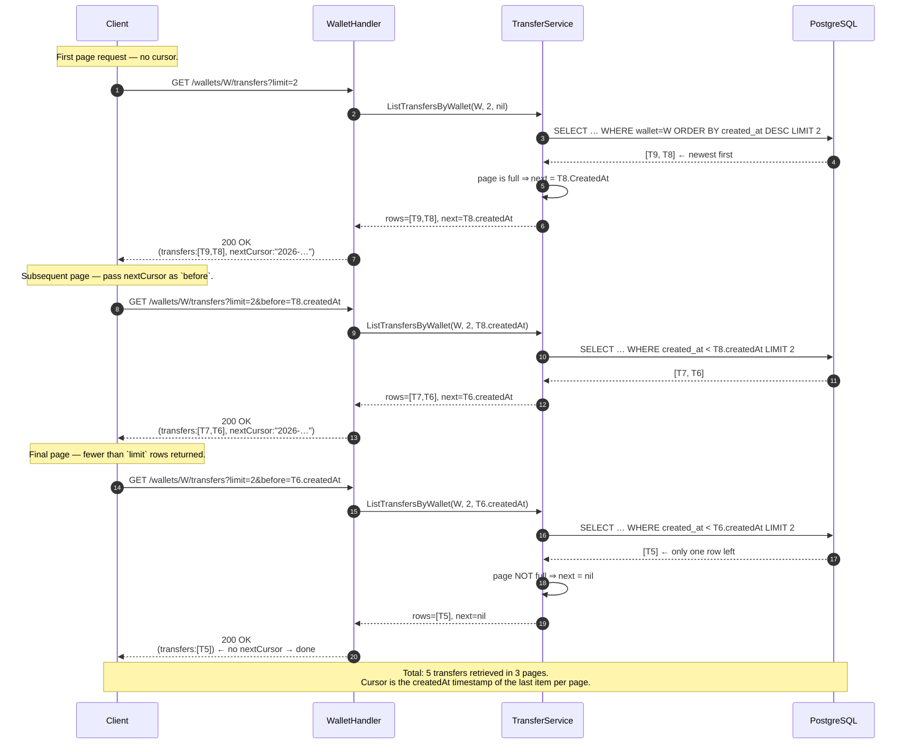
```mermaid
sequenceDiagram
    autonumber
    participant C as Client
    participant H as WalletHandler
    participant S as TransferService
    participant DB as PostgreSQL

    Note over C: First page request — no cursor.
    C->>H: GET /wallets/W/transfers?limit=2
    H->>S: ListTransfersByWallet(W, 2, nil)
    S->>DB: SELECT … WHERE wallet=W ORDER BY created_at DESC LIMIT 2
    DB-->>S: [T9, T8]   ← newest first
    S->>S: page is full ⇒ next = T8.CreatedAt
    S-->>H: rows=[T9,T8], next=T8.createdAt
    H-->>C: 200 OK<br/>(transfers:[T9,T8], nextCursor:"2026-…")

    Note over C: Subsequent page — pass nextCursor as `before`.
    C->>H: GET /wallets/W/transfers?limit=2&before=T8.createdAt
    H->>S: ListTransfersByWallet(W, 2, T8.createdAt)
    S->>DB: SELECT … WHERE created_at < T8.createdAt LIMIT 2
    DB-->>S: [T7, T6]
    S-->>H: rows=[T7,T6], next=T6.createdAt
    H-->>C: 200 OK<br/>(transfers:[T7,T6], nextCursor:"2026-…")

    Note over C: Final page — fewer than `limit` rows returned.
    C->>H: GET /wallets/W/transfers?limit=2&before=T6.createdAt
    H->>S: ListTransfersByWallet(W, 2, T6.createdAt)
    S->>DB: SELECT … WHERE created_at < T6.createdAt LIMIT 2
    DB-->>S: [T5]                ← only one row left
    S->>S: page NOT full ⇒ next = nil
    S-->>H: rows=[T5], next=nil
    H-->>C: 200 OK<br/>(transfers:[T5])   ← no nextCursor → done

    Note over C,DB: Total: 5 transfers retrieved in 3 pages.<br/>Cursor is the createdAt timestamp of the last item per page.
```

**Key takeaways**

- The cursor is the **createdAt timestamp**, not a row id or page
  number. This makes it stable against concurrent inserts:
  newly-inserted transfers (with newer timestamps) are simply not
  visible past the cursor, so a long-running paginating client
  always sees a consistent slice.
- `nextCursor` is omitted (via `omitempty`) only when the page is
  short of `limit`. A short page is the unambiguous "end of
  history" signal; absence-of-cursor in JSON is more conventional
  than a sentinel value.
- The service clamps `limit` to `[1, 200]` regardless of what the
  caller asked for (see `service.MaxTransferListLimit`). A request
  with `?limit=1000000` returns at most 200 rows; clients learn the
  effective cap by observing the response length.

---

## Design choices

Each subsection takes one architecturally-load-bearing decision,
shows the alternative we *didn't* pick, and gives Go code for both
sides so the choice is concrete rather than abstract. Two subsections
at the end (state machine, middleware) describe smaller decisions
that don't have a meaningful alternative worth contrasting against.

### 1. Pessimistic locks + PK-as-mutex idempotency

This is two decisions bundled because they're how we satisfy
**no double-spending** and **exactly-once at the API level**, the
two hardest requirements in [ASSIGNMENT.md](./ASSIGNMENT.md).

**What we picked.** Inside the transfer transaction, lock both
wallet rows with `SELECT ... FOR UPDATE` in lexicographic id order,
then `INSERT` into `idempotency_records` — the PRIMARY KEY on `key`
serialises concurrent first-time inserts via Postgres's index lock.

```go
// internal/service/transfer.go (excerpted)
err := s.txm.RunInTx(ctx, func(exec repository.Executor) error {
    firstID, secondID := orderedPair(req.FromWalletID, req.ToWalletID)
    if _, err := s.wallets.LockForUpdate(ctx, exec, firstID); err != nil {
        return err
    }
    if _, err := s.wallets.LockForUpdate(ctx, exec, secondID); err != nil {
        return err
    }
    src, _ := s.wallets.Get(ctx, exec, req.FromWalletID)
    // ... insert transfer + idempotency record + ledger ...
    if err := s.idem.Insert(ctx, exec, req.IdempotencyKey, hash, t.ID); err != nil {
        return err // returns ErrIdempotencyExists on 23505
    }
    return nil
})
if errors.Is(err, repository.ErrIdempotencyExists) {
    return s.replayIfExists(ctx, s.exec, req.IdempotencyKey, hash)
}
```

```go
// internal/repository/postgres/idempotency.go (excerpted)
const q = `INSERT INTO idempotency_records (key, request_hash, transfer_id) VALUES ($1, $2, $3)`
_, err := exec.ExecContext(ctx, q, key, hash, transferID)
var pgErr *pgconn.PgError
if errors.As(err, &pgErr) && pgErr.Code == "23505" { // unique_violation
    return repository.ErrIdempotencyExists
}
```

**What we didn't pick.** Optimistic concurrency control on a
`version` column with application-level retry, plus a separate
distributed lock (Redis, etcd) for the idempotency key.

```go
// HYPOTHETICAL: optimistic CAS — NOT what we use
for attempt := 0; attempt < maxAttempts; attempt++ {
    src, _ := s.wallets.Get(ctx, exec, srcID)
    if src.Balance < amount {
        return domain.ErrInsufficientFunds
    }
    res, err := exec.ExecContext(ctx,
        `UPDATE wallets SET balance = $1, version = version + 1
         WHERE id = $2 AND version = $3`,
        src.Balance-amount, srcID, src.Version)
    if err != nil { return err }
    if n, _ := res.RowsAffected(); n == 1 {
        break // success
    }
    // version mismatch: another writer beat us; retry
}
// Plus a Redis SETNX for the idempotency key, with a TTL, and a
// careful lock-revoke-on-crash strategy...
```

| | Pros | Cons |
|---|---|---|
| **Pessimistic + PK-mutex (chosen)** | Simple to reason about. Atomicity of side-effect + idempotency is free (same tx). No external dependency. Predictable latency under contention. | Lock holding time is on the critical path. Cannot scale across multiple primary DBs. |
| **Optimistic + Redis lock** | Lower latency for uncontended cases. No DB lock contention. Can scale horizontally. | App must implement retry loop correctly (off-by-one bugs steal money). Idempotency and side-effect commit in different systems → recovery is painful if one fails. Crashed process leaks Redis locks. |

**When the alternative would be the right call.** Multi-region
deployments, hot-key throughput beyond a single Postgres primary,
or any situation where the network round-trip for a row lock would
dominate latency. None of those apply here.

### 2. stdlib `net/http` + `database/sql` (no framework, no ORM)

**What we picked.** Go 1.22's method-aware `ServeMux` for routing,
the standard `database/sql` interface with the `pgx` driver, and
hand-written parameterised SQL.

```go
// internal/handler/router.go
mux := http.NewServeMux()
mux.HandleFunc("POST /transfers", transfer.Create)
mux.HandleFunc("POST /wallets", wallet.Create)
mux.HandleFunc("GET /wallets/{id}", wallet.Get)
mux.HandleFunc("GET /healthz", healthz)
return Chain(mux, RequestID, AccessLog, Recover)
```

```go
// internal/repository/postgres/wallet.go (excerpted)
const q = `SELECT id, balance, created_at, updated_at FROM wallets WHERE id = $1`
row := exec.QueryRowContext(ctx, q, id)
return scanWallet(row)
```

**What we didn't pick.** A router framework (chi, gin, echo) and
an ORM (GORM, ent, sqlc-generated code).

```go
// HYPOTHETICAL: chi + GORM — NOT what we use
r := chi.NewRouter()
r.Use(middleware.RequestID, middleware.Logger, middleware.Recoverer)
r.Post("/transfers", transfer.Create)
r.Get("/wallets/{id}", wallet.Get)

// And inside the wallet repo:
var w Wallet
if err := db.WithContext(ctx).Where("id = ?", id).First(&w).Error; err != nil {
    return nil, err
}
```

| | Pros | Cons |
|---|---|---|
| **stdlib (chosen)** | Zero framework version churn. Anything reviewers know about `net/http` and `database/sql` transfers directly. Every SQL query is visible at the call site (huge for reviewing transactional code). | More boilerplate for very repetitive scan code. No automatic OpenAPI generation. |
| **chi + GORM** | Less wiring per route. Some convenience features (auto-bind JSON, struct tags). | Framework upgrades break things. ORMs hide the actual SQL — exactly the layer this assignment is testing. Concurrency semantics (FOR UPDATE, transactions) get harder to audit. |

**When the alternative would be the right call.** Large CRUD-heavy
services with dozens of similar endpoints, teams already invested
in a specific framework's ecosystem, or services that need
automatic OpenAPI / GraphQL schema generation. Not here — the
assignment specifically tests our handling of locks, transactions,
and SQL.

### 3. Single transaction per request (not saga / outbox)

**What we picked.** The entire transfer — wallet locks, ledger
entries, idempotency record, state transitions — commits or rolls
back in **one** Postgres transaction.

```go
// internal/service/transfer.go (excerpted)
err := s.txm.RunInTx(ctx, func(exec repository.Executor) error {
    // 1. lock both wallets in id order
    // 2. read balances
    // 3. insert transfer (PENDING)
    // 4. insert idempotency record
    // 5. update balances
    // 6. insert ledger entries (DEBIT + CREDIT)
    // 7. mark transfer PROCESSED
    return nil
})
```

The `RunInTx` helper guarantees: panic → ROLLBACK + re-panic;
error → ROLLBACK; nil → COMMIT.

**What we didn't pick.** A saga pattern (or outbox pattern), where
each step is its own short-lived transaction and an external
coordinator reconciles after a crash.

```go
// HYPOTHETICAL: saga steps — NOT what we use
reserveID, err := svc.ReserveFunds(ctx, srcID, amount)            // tx 1
if err != nil { return err }

if err := svc.NotifyExternalBank(ctx, srcID, dstID, amount); err != nil {
    _ = svc.CancelReservation(ctx, reserveID)                     // tx N
    return err
}

if err := svc.CommitReservation(ctx, reserveID); err != nil {     // tx 2
    // recovery is now the saga coordinator's problem
    return err
}
```

| | Pros | Cons |
|---|---|---|
| **Single tx (chosen)** | All-or-nothing atomicity for free. Recovery is implicit (a crash mid-transaction rolls back). Easiest possible mental model. | Long transactions can block other writers. Won't scale to cross-service / cross-DB flows. Bounded throughput by single-DB write capacity. |
| **Saga / outbox** | Survives multi-system flows (e.g. an external bank API call as part of the transfer). Smaller per-step locks. | Each step needs its own idempotency. Compensation logic must be correct for every step. Reasoning about partial-failure states is significantly harder. |

**When the alternative would be the right call.** Cross-service
flows that touch external bank APIs, payment processors, or
multiple internal microservices. None of that is in scope here —
the assignment is explicitly a single-service exercise.

### 4. Testcontainers (real Postgres) over sqlmock

**What we picked.** Every integration test boots a real
`postgres:16-alpine` container via `testcontainers-go`, applies the
real migrations, and exercises the code through real SQL.

```go
// internal/service/transfer_integration_test.go (excerpted)
func TestCreateTransfer_ConcurrentDebits(t *testing.T) {
    testdb.Reset(t)
    tsvc, wsvc := newTransferSvc(t)
    seedWallets(t, wsvc, map[string]int64{"src": 1000, "dst": 0})

    var wg sync.WaitGroup
    for i := 0; i < 20; i++ {
        wg.Add(1)
        go func(i int) {
            defer wg.Done()
            _, _ = tsvc.Create(ctx, service.CreateTransferRequest{
                IdempotencyKey: keyFor(i),
                FromWalletID:   "src",
                ToWalletID:     "dst",
                Amount:         100,
            })
        }(i)
    }
    wg.Wait()

    src, _ := wsvc.Get(ctx, "src")
    // src.Balance MUST NOT go negative; tested against the real
    // FOR UPDATE + CHECK constraint behaviour, not a mock.
}
```

**What we didn't pick.** Mocking `*sql.DB` with `sqlmock` or
similar; mocking the repository interfaces in service tests.

```go
// HYPOTHETICAL: sqlmock — NOT what we use
func TestCreateTransfer_HappyPath(t *testing.T) {
    db, mock, _ := sqlmock.New()
    defer db.Close()
    mock.ExpectBegin()
    mock.ExpectQuery(`SELECT .* FROM wallets .* FOR UPDATE`).
        WillReturnRows(sqlmock.NewRows([]string{"id", "balance", ...}).
            AddRow("src", 1000, time.Now(), time.Now()))
    mock.ExpectExec(`UPDATE wallets SET balance`).
        WillReturnResult(sqlmock.NewResult(0, 1))
    mock.ExpectCommit()
    // ... call service.Create ...
}
```

| | Pros | Cons |
|---|---|---|
| **Real DB (chosen)** | Tests the actual SQL contract — typos in `FOR UPDATE`, missing CHECK constraints, FK violations all surface. Concurrency tests genuinely test locking. Schema/code drift is impossible. | First test pays a ~2s container-boot cost. Requires Docker. Slightly heavier in CI. |
| **sqlmock** | Pure unit semantics. No external dependencies. Sub-millisecond tests. | Tests pass even if the SQL is wrong, the lock is missing, the FK is misnamed, or the constraint never existed. Mocks must be hand-kept in sync with reality — they routinely aren't. Concurrency races become untestable. |

**When the alternative would be the right call.** Testing pure
business logic with no DB interaction (we do that in
`internal/domain/transfer_test.go`), or in environments where
Docker truly isn't available. For a financial service whose entire
correctness contract lives in the database constraints + locking,
mocks would defeat the purpose of testing.

### 5. Transfer state machine: PENDING → terminal in the same tx

`PENDING → PROCESSED` and `PENDING → FAILED` are the only valid
transitions; both terminal states are sinks. The `PENDING` write
happens inside the same transaction that drives the row to a
terminal state, so it is never observable to a successful read
outside the tx.

We keep the column (rather than inserting straight into
`PROCESSED`/`FAILED`) so an async or queued-settlement variant can
be added later without a schema change — only the service flow
would shift; the data model already supports it.

There isn't really an "alternative" worth contrasting against here:
the column is a future-proofing choice, not a tradeoff.

### 6. Middleware chain — observability + safety net

Every HTTP request flows through a three-stage chain configured in
[`internal/handler/router.go`](internal/handler/router.go):

```text
RequestID  →  AccessLog  →  Recover  →  ServeMux
```

- **RequestID** reads `X-Request-Id` from the inbound request or
  generates a UUID, attaches it to the response and to the request
  context. `handler.RequestIDFromContext(ctx)` makes it available
  to service code if needed.
- **AccessLog** emits one structured log line per request via
  `slog.LogAttrs(... "http_request", method, path, status,
  duration_ms, request_id)`. Request bodies are never logged
  (AGENTS.md §S-6).
- **Recover** is the last line of defence: panics are caught,
  logged with a stack trace and the request id, and translated to
  a 500 with a generic error body so clients never see a goroutine
  dump.

The chain order matters: `RequestID` runs first so the id is in
the context before anything else logs; `AccessLog` wraps the
response writer so it sees the final status (including 500s
produced by `Recover`); `Recover` is innermost so it catches
panics from the routed handler.

---

## Threat model / attack surface

What a defender cares about: where does untrusted input enter, what
boundaries does it cross, and what control is responsible for
stopping each class of attack.

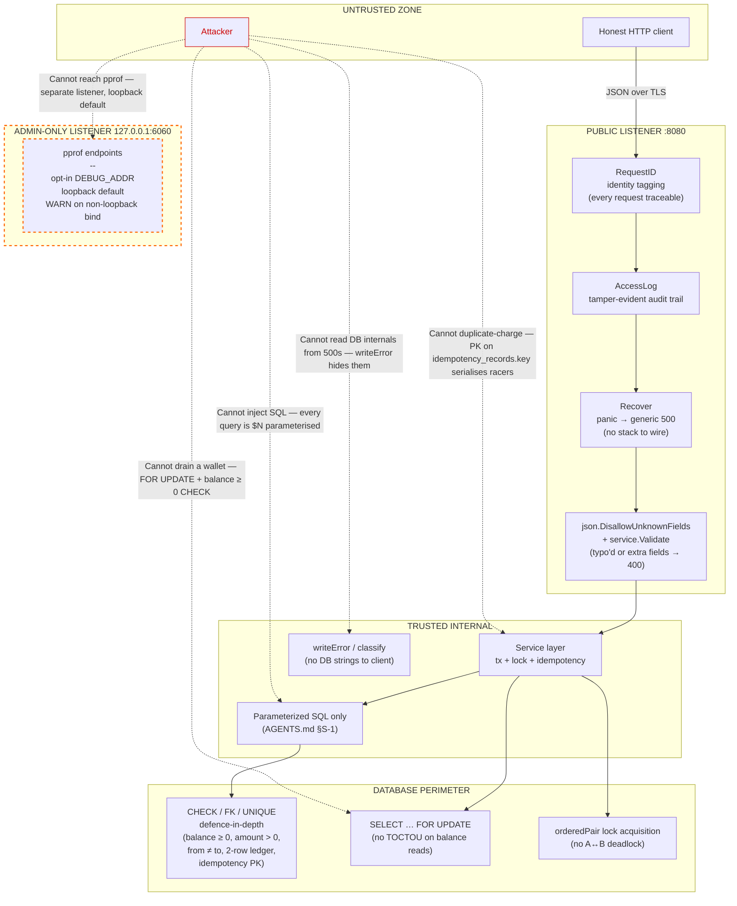
```mermaid
flowchart TB
    subgraph untrusted["UNTRUSTED ZONE"]
        client[Honest HTTP client]
        attacker[Attacker]
    end

    subgraph pub["PUBLIC LISTENER :8080"]
        rid["RequestID<br/>identity tagging<br/>(every request traceable)"]
        acl["AccessLog<br/>tamper-evident audit trail"]
        rec["Recover<br/>panic → generic 500<br/>(no stack to wire)"]
        dec["json.DisallowUnknownFields<br/>+ service.Validate<br/>(typo'd or extra fields → 400)"]
    end

    subgraph trusted["TRUSTED INTERNAL"]
        svc["Service layer<br/>tx + lock + idempotency"]
        sql["Parameterized SQL only<br/>(AGENTS.md §S-1)"]
        err["writeError / classify<br/>(no DB strings to client)"]
    end

    subgraph admin["ADMIN-ONLY LISTENER 127.0.0.1:6060"]
        pprof["pprof endpoints<br/>--<br/>opt-in DEBUG_ADDR<br/>loopback default<br/>WARN on non-loopback bind"]
    end

    subgraph dbperim["DATABASE PERIMETER"]
        checks["CHECK / FK / UNIQUE<br/>defence-in-depth<br/>(balance ≥ 0, amount > 0,<br/>from ≠ to, 2-row ledger,<br/>idempotency PK)"]
        forupdate["SELECT … FOR UPDATE<br/>(no TOCTOU on balance reads)"]
        ordered["orderedPair lock acquisition<br/>(no A↔B deadlock)"]
    end

    client -->|"JSON over TLS"| rid
    rid --> acl --> rec --> dec --> svc
    svc --> sql --> checks
    svc --> forupdate
    svc --> ordered

    attacker -. "Cannot inject SQL — every query is $N parameterised" .-> sql
    attacker -. "Cannot read DB internals from 500s — writeError hides them" .-> err
    attacker -. "Cannot duplicate-charge — PK on idempotency_records.key serialises racers" .-> svc
    attacker -. "Cannot drain a wallet — FOR UPDATE + balance ≥ 0 CHECK" .-> forupdate
    attacker -. "Cannot reach pprof — separate listener, loopback default" .-> pprof

    classDef adminStyle stroke:#f60,stroke-width:2px,stroke-dasharray:5
    classDef attackStyle stroke:#c00,color:#c00
    class admin,pprof adminStyle
    class attacker attackStyle
```

**Key takeaways**

- Every attack class has a *named* control. There is no "we'll
  catch it in code review" — each item maps to either a code-level
  guard (parameterised SQL, writeError, DisallowUnknownFields) or
  a schema-level guard (CHECK, FK, UNIQUE, FOR UPDATE).
- Defence in depth is explicit: the same invariant (balance ≥ 0,
  amount > 0, transfer unique per idempotency key, etc.) is
  enforced both in the service layer and at the schema level. A
  buggy commit that removes a service-level check would still be
  caught by the DB.
- The admin surface (pprof) is structurally separated from the
  public surface — there is no way to accidentally expose it on
  the public port, because the two listeners are different
  `http.Server` values bound to different addresses.

---

## API reference

All endpoints accept and return JSON. Errors return
`{"error": "<message>"}` with an HTTP status that matches the failure
class.

### `POST /wallets`

Seed a wallet. Convenience endpoint for tests / bootstrapping.

```http
POST /wallets
Content-Type: application/json

{
  "id": "w1",
  "balance": 1000
}
```

→ `201 Created`
```json
{ "id": "w1", "balance": 1000 }
```

### `GET /wallets/{id}`

→ `200 OK`
```json
{ "id": "w1", "balance": 750 }
```

→ `404 Not Found` if the wallet does not exist.

### `POST /transfers`

```http
POST /transfers
Content-Type: application/json

{
  "idempotencyKey": "abc123",
  "fromWalletId": "w1",
  "toWalletId": "w2",
  "amount": 250
}
```

→ `200 OK` — same response shape for both new transfers and replays:
```json
{
  "id": "0c4d3b71-3a3a-4b27-9e6f-1c2d8a1f6b1e",
  "fromWalletId": "w1",
  "toWalletId": "w2",
  "amount": 250,
  "state": "PROCESSED",
  "createdAt": "2026-05-27T13:00:00.000Z",
  "updatedAt": "2026-05-27T13:00:00.000Z"
}
```

For an insufficient-funds outcome the body includes the failure reason:
```json
{
  "id": "...",
  "state": "FAILED",
  "failureReason": "insufficient funds",
  ...
}
```

| Status            | When                                                          |
|-------------------|---------------------------------------------------------------|
| `200 OK`          | Transfer created or replayed (including `FAILED`)            |
| `400 Bad Request` | Validation error (missing key, non-positive amount, same wallet, malformed JSON) |
| `404 Not Found`   | A referenced wallet does not exist                            |
| `409 Conflict`    | Same idempotency key, different request body                  |
| `500 Internal`    | Anything else                                                 |

### `GET /transfers/{id}`

→ `200 OK` with the same body shape as `POST /transfers`.
→ `400 Bad Request` if `{id}` is not a valid UUID.
→ `404 Not Found` if no transfer matches.

### `GET /wallets/{id}/transfers`

Returns the per-wallet transfer history (most recent first), with
cursor-based pagination.

Query parameters:

| Name | Type | Default | Notes |
|---|---|---|---|
| `limit` | integer | `50` | clamped to `[1, 200]` |
| `before` | RFC 3339 timestamp | – | pass `nextCursor` from the previous page |

Response shape:

```json
{
  "transfers": [
    { "id": "...", "fromWalletId": "w1", "toWalletId": "w2",
      "amount": 250, "state": "PROCESSED",
      "createdAt": "2026-05-27T13:00:00.000Z",
      "updatedAt": "2026-05-27T13:00:00.000Z" }
  ],
  "nextCursor": "2026-05-27T13:00:00.000000123Z"
}
```

`nextCursor` is omitted when the page is not full — that is the
"reached the end of history" signal to clients. To paginate, pass
the cursor back as `?before=...` on the next request.

**Notes**

- A wallet that has zero transfers (or does not exist at all)
  returns `200 OK` with an empty `transfers` array and no cursor.
  We deliberately do not 404 on unknown wallets here so the
  endpoint cannot be used to enumerate which wallet ids exist.
- The result includes both incoming and outgoing transfers
  (the wallet appears as `from_wallet_id` *or* `to_wallet_id`).
- FAILED transfers are included — they are committed rows with a
  `state` value, not deletions.

### `GET /healthz`

→ `200 OK` with body `ok`. Liveness check.

---

## Configuration

Read from environment variables at startup. See
[`internal/config/config.go`](internal/config/config.go).

| Variable | Required | Default | Meaning |
|---|---|---:|---|
| `DATABASE_URL` | yes | – | Postgres DSN (`postgres://…`) |
| `HTTP_ADDR` | no | `:8080` | Address the HTTP server binds to |
| `DEBUG_ADDR` | no | (empty = disabled) | If set, starts the pprof admin listener on this address. **Use loopback only.** See [pprof](#pprof). |
| `DB_MAX_OPEN_CONNS` | no | 25 | Cap on concurrent DB connections. Raise in lock-step with Postgres's `max_connections` |
| `DB_MAX_IDLE_CONNS` | no | 5 | Connections kept warm between requests |
| `DB_CONN_MAX_LIFETIME` | no | `5m` | Max age before the pool retires a connection (set lower than upstream LB / pgbouncer idle cut) |
| `DB_CONN_MAX_IDLE_TIME` | no | `1m` | Max idle before the pool closes a connection |

---

## How to run

Prerequisites: Go 1.25+, Docker (for local Postgres and integration tests).

```sh
make db-up         # starts postgres on :5432 via docker compose
make run           # runs the server on :8080; migrations apply at startup
```

End-to-end smoke test:

```sh
curl -s -X POST localhost:8080/wallets -d '{"id":"w1","balance":1000}'
curl -s -X POST localhost:8080/wallets -d '{"id":"w2","balance":0}'

curl -s -X POST localhost:8080/transfers -d '{
  "idempotencyKey":"abc123",
  "fromWalletId":"w1",
  "toWalletId":"w2",
  "amount":250
}'

curl -s localhost:8080/wallets/w1   # {"id":"w1","balance":750}
curl -s localhost:8080/wallets/w2   # {"id":"w2","balance":250}

# Replay - same key, same body, identical response, no extra debit
curl -s -X POST localhost:8080/transfers -d '{
  "idempotencyKey":"abc123",
  "fromWalletId":"w1",
  "toWalletId":"w2",
  "amount":250
}'
curl -s localhost:8080/wallets/w1   # still {"id":"w1","balance":750}
```

---

## pprof

The service can expose Go's standard runtime profiling endpoints on a
**separate listener** so they're never accidentally served on the public
API port.

To enable:

```sh
DEBUG_ADDR=127.0.0.1:6060 make run
```

(`make run` already sets `DEBUG_ADDR=127.0.0.1:6060` by default.) Then:

```sh
make pprof-heap        # open the heap profile in the browser
make pprof-cpu         # capture a 30s CPU profile and open it
make pprof-goroutine   # open the goroutine profile
make pprof-trace       # capture a 5s execution trace
```

### Security

pprof exposes substantial internals — goroutine dumps, heap state, CPU
profiles, and `cmdline` (which can leak process arguments). The service
treats it accordingly:

- It runs on its **own listener**, never on the public API port.
- It is **opt-in** via `DEBUG_ADDR`; the default is disabled.
- If `DEBUG_ADDR` is set to a non-loopback address, startup logs a
  `WARN` line so the operator knows the runtime is exposed.

Production deployments should either keep `DEBUG_ADDR` empty or bind it
to `127.0.0.1`/an admin-only network and rely on the firewall.

---

## Observability — Prometheus metrics + OpenTelemetry tracing

### Metrics (Prometheus)

Metrics live in [`internal/metrics`](internal/metrics) on a private
`*prometheus.Registry` and are served at `/metrics` on the **debug
listener** (same admin-only listener as pprof — never on the public
API port).

Exposed series:

| Metric | Type | Labels | Meaning |
|---|---|---|---|
| `wallet_transfers_total` | counter | `state` | Completed transfer outcomes (PROCESSED, FAILED) |
| `wallet_transfer_duration_seconds` | histogram | `state` | End-to-end transfer processing time |
| `wallet_http_requests_total` | counter | `method`, `route`, `status` | All HTTP requests, labelled by route *pattern* (not raw path — avoids cardinality blowup) |
| `wallet_http_request_duration_seconds` | histogram | `method`, `route` | HTTP request latency |
| `process_*`, `go_*` | (default) | – | Standard Prometheus process + go runtime collectors |

The HTTP metrics are emitted by the `metrics.HTTPMiddleware` wrapped
around the route mux in `cmd/server/main.go`. Transfer metrics are
emitted by `TransferService.Create` itself, so they capture every
terminal outcome including replays.

To scrape:

```sh
DEBUG_ADDR=127.0.0.1:6060 make run
curl -s 127.0.0.1:6060/metrics | head -20
```

### Tracing (OpenTelemetry)

Tracing lives in [`internal/tracing`](internal/tracing). The default
exporter is `stdouttrace` — spans are emitted to stderr as
pretty-printed JSON, so a reviewer running `make run` locally sees
spans immediately, without setting up Jaeger/Tempo/an OTLP collector.

Every HTTP request becomes a parent span (via the `otelhttp.Handler`
wrap in `cmd/server/main.go`), and `TransferService.Create` opens
a child span with the standard attributes (`transfer.from_wallet_id`,
`transfer.to_wallet_id`, `transfer.amount`, `transfer.state`). New
service methods can join the trace just by calling
`tracing.Tracer().Start(ctx, "...")` and deferring `span.End()`.

Switching to an OTLP collector (Tempo, Jaeger, Honeycomb, etc.) is a
constructor-swap in `tracing.Setup` — no service-layer changes
required.

---

## Concurrency and scale

What this service can handle and how that's proven. All numbers
below are **measured** on an Apple M1 Max with a local Postgres 16
container; rerun the same `make` targets to reproduce.

### Throughput numbers

#### Sustained HTTP load (k6, 60s at 300 RPS, 20 wallet pairs)

| Metric | Value |
|---|---:|
| Requests served | 17,999 |
| Requests/sec sustained | 297 |
| Failed requests | 0 (0.00%) |
| Transfers completed (PROCESSED) | 17,959 |
| Latency p50 | 23 ms |
| Latency p95 | 83 ms |
| Latency p99 | 298 ms |
| Latency max | 964 ms |

Reproduce with `make db-up && make run` (one terminal) and
`make load` (another). See [`loadtest/transfer.js`](loadtest/transfer.js)
for the scenario. Override `RPS=`, `DURATION=`, `WALLETS=`,
`BASE_URL=` to explore the response curve.

#### Go service-layer benchmarks (`make bench`)

| Benchmark | ns/op | B/op | allocs/op | Throughput |
|---|---:|---:|---:|---:|
| `TransferService.Create` (sequential) | 15,386,689 | 17,019 | 404 | ~65 tx/s |
| `TransferService.Create` (b.RunParallel) | 13,111,824 | 18,809 | 412 | ~76 tx/s |
| `TransferService.GetTransfer` | 988,106 | 2,354 | 63 | ~1,011 ops/s |
| `TransferService.ListTransfersByWallet` | 1,815,936 | 36,680 | 590 | ~550 ops/s |
| `TransferService.IdempotentReplay` (fast path) | 2,050,488 | 4,228 | 101 | ~488 ops/s |

The replay number deserves a comment: it's slower per op than
`GetTransfer` only because it does two SELECTs (idempotency lookup
+ transfer lookup) instead of one. It is still ~7× faster than a
fresh `Create` because it never opens a transaction or takes a
wallet lock.

#### Stress tests (`make stress`)

| Test | Goroutines / requests | Wall time | Result |
|---|---|---|---|
| `TestStress_HotWallet` | 1,000 goroutines × 1 debit each, one source wallet, balance 10,000 | ~10s | Exactly 100 PROCESSED + 900 FAILED. Source balance never < 0. Sum conserved. |
| `TestStress_ManyWallets` | 10,000 transfers across 100 wallets via 50 workers | ~19s | 9,997 PROCESSED + 3 FAILED (insufficient funds on random pairs). 533 tx/s sustained. Conservation invariant holds across all 100 wallets. |
| `TestStress_NoGoroutineLeak` | 200 transfers, then count goroutines before/after | ~3s | Δ = 0 |

### What stays safe under that load

| Concern | What protects it |
|---|---|
| Double-spend on a hot wallet | `SELECT ... FOR UPDATE` blocks concurrent debits until the holder commits. The schema's `CHECK (balance >= 0)` is the second line of defence. `TestStress_HotWallet` proves it under 1,000-goroutine contention. |
| Deadlock between counter-direction transfers (A→B and B→A) | Both transactions acquire wallet locks in lexicographic id order via `orderedPair`. Postgres never detects a cycle. |
| Duplicate transfers on retry | `idempotency_records.key` is a PRIMARY KEY; the second concurrent insert blocks on the PK index and then receives SQLSTATE 23505, which the service maps to the replay path. `TestCreateTransfer_ConcurrentSameKey` proves this at N=25; the load test proves it at scale. |
| DB-connection exhaustion at high RPS | The pool is bounded via `DB_MAX_OPEN_CONNS` (default 25). Requests queue on a bounded waiter inside `database/sql` rather than opening unbounded connections and getting Postgres SQLSTATE 53300 ("too many clients already"). |
| Goroutine leaks under sustained load | `TestStress_NoGoroutineLeak` snapshots `runtime.NumGoroutine` before / after a burst and asserts Δ ≤ slack. |

### Where the bottleneck is, and how to push it further

The single-Postgres ceiling on this workload, on this hardware, is
~300 req/s before the DB-pool saturation starts pushing p99 up.
To go higher:

1. **Raise the pool**: bump `DB_MAX_OPEN_CONNS` (and Postgres's
   `max_connections`, of course) in lock-step. Each open connection
   costs ~10 MB of Postgres RAM, so this is bounded.
2. **Spread the hot wallet**: when one wallet is the bottleneck,
   the lock is the bottleneck. The architecture is correct; the
   physics aren't negotiable. Real systems shard at the wallet
   level (route every request for wallet id X to the same shard
   so different shards can run independent transactions).
3. **Async / batch the ledger writes**: today every transfer does 2
   ledger INSERTs synchronously. A batched outbox + worker would
   move those out of the request path. Documented as a flip-point
   in [§Design choices #3](#3-single-transaction-per-request-not-saga--outbox).
4. **Read replica for history queries**: `GET /wallets/{id}/transfers`
   is read-heavy and tolerates slight staleness. A second `*sql.DB`
   bound to a replica would take history-list load off the
   write primary entirely.

### Pool tuning configuration

| Env var | Default | When to raise |
|---|---:|---|
| `DB_MAX_OPEN_CONNS` | 25 | When RPS approaches the current pool-saturation ceiling (~300 RPS on this hardware) AND Postgres has free `max_connections` headroom |
| `DB_MAX_IDLE_CONNS` | 5 | If traffic is bursty and you want connections kept warm between bursts |
| `DB_CONN_MAX_LIFETIME` | 5m | Lower if your load balancer / pgbouncer cuts idle connections sooner than this (or you'd hand out half-closed conns) |
| `DB_CONN_MAX_IDLE_TIME` | 1m | Lower to free Postgres connections faster during quiet periods |

### Commands you'll actually run

```sh
make db-up                                  # start Postgres
make run                                    # start the API
DEBUG_ADDR=127.0.0.1:6060 make run          # + pprof + /metrics
make stress                                 # 1k-goroutine hot-wallet + 10k-transfer many-wallet stress, ~35s
make bench                                  # Go service-layer benchmarks, ~90s
make load                                   # k6 sustained-load test against `make run`, ~60s
make pprof-cpu                              # capture a 30s CPU profile while load is running
```

---

## How to test
make test          # unit tests (no Docker needed)
make test-int      # integration tests (testcontainers, requires Docker)
make test-all      # both
```

Integration tests boot a single shared Postgres 16 container per package
(via `internal/testdb`), apply migrations, and truncate tables between
subtests.

Cross-package coverage measurement:

```sh
go test -race -tags=integration -count=1 -timeout=300s \
    -coverpkg=./... -coverprofile=coverage.out ./...
go tool cover -func=coverage.out | tail -1
go tool cover -html=coverage.out -o coverage.html   # for the browser view
```

---

## Test coverage

**Total: 88.1% of statements** (cross-package, `-coverpkg=./...`).

**Executed test cases:** **146** (functions + subtests under
`go test -v -tags=integration ./...`).

| Package | Coverage | Notes |
|---|---|---|
| `internal/domain` | **100.0%** | Pure state machine; every branch exercised |
| `internal/config` | **100.0%** | All three load paths covered |
| `internal/handler` | ~95% | Every status-code mapping in `classify` covered; healthz + 404/405 + invalid-JSON + unknown-fields included |
| `internal/repository/postgres` | ~90% | All happy paths + `not_found` + unique-violation + `RunInTx` commit / rollback / panic paths |
| `internal/service` | ~90% | Happy + insufficient-funds + replay + conflict + missing-wallet + 20-goroutine concurrent debit + same-key collapsing |
| `internal/db` | ~85% | `Open` success + invalid-DSN + unreachable-host; `Migrate` success |
| `cmd/server` | `run` 96%, `main` 0% | `run` driven via context + free port + `/healthz` poll; `main` itself is a 4-line wrapper around `os.Exit` and `signal.NotifyContext` and is not unit-tested by convention |

Uncovered branches are deliberate: low-level error-wrapping inside
infrastructure code (e.g. `RunInTx` rollback failures, `db.Migrate`
driver-init errors) and the `os.Exit` path in `main()`. Exercising
them would require either dependency-injecting fakes everywhere or
spawning the binary as a subprocess — both judged worse than the
current behavioural clarity.

### Requirement → test map

| Requirement (from ASSIGNMENT.md / evaluation_guide.md) | Test |
|---|---|
| State machine — only legal transitions | `domain.TestTransferState_CanTransitionTo` |
| State enum — only valid values | `domain.TestTransferState_Valid` |
| Happy-path transfer updates both balances | `service.TestCreateTransfer_HappyPath` |
| Exactly two balanced ledger entries per transfer | `service.TestCreateTransfer_LedgerEntriesBalance` |
| Insufficient funds → `FAILED`, no balance change | `service.TestCreateTransfer_InsufficientFunds` |
| Failed transfer is replayable with same result | `service.TestCreateTransfer_FailedTransferIsReplayable` |
| Idempotent replay returns the same transfer | `service.TestCreateTransfer_IdempotencyReplay` |
| Same key + different body → conflict | `service.TestCreateTransfer_IdempotencyConflict` |
| Validation: missing key / bad amount / self-transfer | `service.TestCreateTransfer_Validation` |
| Missing source/dest wallet rejected | `service.TestCreateTransfer_FromWalletMissing`, `…ToWalletMissing` |
| **Concurrency: no double-spend on a hot wallet** | `service.TestCreateTransfer_ConcurrentDebits` |
| **Concurrency: same key from N goroutines → 1 transfer** | `service.TestCreateTransfer_ConcurrentSameKey` |
| Transfer lookup by id | `service.TestGetTransfer_Existing`, `…NotFound` |
| Wallet seeding validation + uniqueness | `service.TestWalletService_CreateValidation`, `…CreateDuplicate` |
| Transactional commit, rollback on error, rollback on panic | `postgres.TestTxManager_Commit`, `…RollbackOnError`, `…RollbackOnPanic` |
| Wallet/Transfer/Idempotency repository not-found paths | `postgres.TestWalletRepo_Get_NotFound`, `…UpdateBalance_NotFound`, `…Insert_DuplicateRejected`, `postgres.TestTransferRepo_Get_NotFound`, `…UpdateState_NotFound`, `postgres.TestIdempotencyRepo_Get_NotFound`, `…Insert_ConflictMappedToSentinel` |
| Ledger list balances debits and credits | `postgres.TestLedgerRepo_ListByTransfer` |
| HTTP happy path + replay returns identical id | `handler.TestHTTP_TransferHappyAndReplay` |
| HTTP conflict returns 409 | `handler.TestHTTP_TransferConflict` |
| HTTP validation returns 400 | `handler.TestHTTP_TransferValidationErrors` |
| HTTP `GET /wallets/{id}` 404 | `handler.TestHTTP_GetWalletNotFound` |
| HTTP transfer referencing missing wallet | `handler.TestHTTP_TransferReferencingMissingWallet` |
| HTTP rejects malformed JSON | `handler.TestHTTP_InvalidJSON` |
| HTTP rejects unknown JSON fields | `handler.TestHTTP_UnknownJSONField` |
| HTTP `POST /wallets` validation + invalid JSON | `handler.TestHTTP_CreateWalletNegativeBalance`, `…CreateWalletInvalidJSON` |
| HTTP healthz | `handler.TestNewRouter_Healthz`, `…UnknownRoute`, `…WrongMethod` |
| Error → status code mapping (every sentinel) | `handler.TestClassify`, `handler.TestWriteError_Status`, `handler.TestWriteError_500HidesInternals`, `handler.TestWriteJSON_NilBody` |
| Middleware: request id generation & inbound preservation | `handler.TestRequestID_GeneratesWhenMissing`, `…PreservesInbound`, `TestRequestIDFromContext_AbsentReturnsEmpty` |
| Middleware: structured access log fields + default status | `handler.TestAccessLog_EmitsStructuredLine`, `…DefaultsStatusTo200` |
| Middleware: panic recovery → 500 with safe body | `handler.TestRecover_CatchesPanicAndReturns500`, `…PassesThroughOnNoPanic` |
| Middleware chain composes in declared order | `handler.TestChain_OrderIsOutermostFirst` |
| Config env loading: required DSN, default + custom HTTP addr, debug addr opt-in | `config.TestLoad_RequiresDatabaseURL`, `…DefaultsHTTPAddr`, `…CustomHTTPAddr`, `…DebugAddrDefaultsDisabled`, `…DebugAddrCustom` |
| pprof: debug mux serves profiles, doesn't serve app routes | `handler.TestNewDebugMux_ServesPprofIndex`, `…RegistersStandardProfiles`, `…DoesNotServeAppRoutes` |
| pprof: enabled only on `DEBUG_ADDR`, not on the API port | `cmd/server.TestRun_DebugListenerServesPprof` |
| pprof: loopback detection for warn-on-non-loopback | `cmd/server.TestIsLoopbackAddr` |
| DB open: invalid DSN, unreachable host | `db.TestOpen_InvalidDSN`, `db.TestOpen_UnreachableHost` |
| End-to-end `run()`: graceful shutdown, bad DSN, bad listener | `cmd/server.TestRun_GracefulShutdown`, `…BadDatabaseURL`, `…BadHTTPAddr` |
| Transfer history — single fetch (200/404/400 paths) | `handler.TestHTTP_GetTransferByID_HappyPath`, `…NotFound`, `…MalformedUUID` |
| Wallet history — pagination, defaults, clamping, empty wallets | `service.TestListTransfersByWallet_EmptyHistory`, `…EmptyWalletID`, `…OrderedByCreatedAtDesc`, `…LimitDefault`, `…LimitClamp`, `…PaginationByCursor`, `…BothFromAndTo`, `…CursorBeforeAll`, `…FailedTransfersIncluded` |
| Wallet history HTTP — happy + pagination + query validation + empty + cursor signalling | `handler.TestHTTP_ListWalletTransfers_HappyPathWithPagination`, `…EmptyForUnknownWallet`, `…BadLimit`, `…BadBefore`, `…LimitOneReturnsCursor`, `…NoCursorOnLastPage` |
| Metrics — registry, counter increments by label, histogram, /metrics format, route-pattern cardinality | `metrics.TestRegistry_HasStandardCollectors`, `…TestTransfersTotal_IncrementsByLabel`, `…TestTransferDuration_ObservesAcrossLabels`, `…TestHandler_ServesPrometheusExposition`, `…TestHTTPMiddleware_LabelsByRoute`, `…UnmatchedRoutesUseSentinel`, `…DefaultStatusIs200` |
| Metrics — exposed on debug listener only | `handler.TestNewDebugMux_ServesPrometheusMetrics` (combined with debug isolation tests) |
| Tracing — global provider registration, no-op fallback, service name preservation | `tracing.TestSetup_RegistersGlobalProvider`, `tracing.TestTracer_NoSetupReturnsNoOp`, `tracing.TestServiceName_IsExported` |
| Domain corner cases — zero-value structs, max int64 amounts, unicode wallet ids, timestamp precision | `domain.TestWallet_ZeroValueIsValid`, `…AcceptsMaxInt64Balance`, `…AllowsLargeAndUnicodeIDs`, `…TimestampsArePreserved`, `…TestLedgerEntry_ZeroValueIsValid`, `…AcceptsLargeAmount`, `…TestEntryType_Constants` |
| Domain error sentinels — distinct, non-empty, wrap-preserves-Is | `domain.TestErrors_AreDistinctSentinels`, `…HaveNonEmptyMessages`, `…WrappingPreservesIs` |

---

## Tradeoffs and assumptions

- **Wallet IDs are caller-supplied strings.** The assignment uses
  `wallet_1` / `wallet_2`, so the schema uses `TEXT` rather than `UUID` to
  preserve that ergonomics.
- **Amounts are stored as `BIGINT`.** Treated as integer minor units
  (cents). A real system would also carry a currency column and reject
  cross-currency transfers.
- **No partial transfers, no fees, no FX.** Out of scope per the assignment.
- **Wallets seeded via API.** The `POST /wallets` endpoint exists for
  test convenience and is intentionally unauthenticated. In production it
  would be replaced with provisioning under an admin scope.
- **No background workers.** All work happens synchronously inside the
  request transaction; the `PENDING` state is written and immediately
  transitioned in the same tx. The state column is preserved so an async
  variant can be added without schema changes.
- **`request_hash` covers `from|to|amount` only.** Adding more fields
  (currency, memo) later is purely additive.
- **Pessimistic locking.** See [Design choices](#design-choices) for the
  rationale.
- **Observability is request-scoped, not distributed.** Each request gets
  an `X-Request-Id` and a structured access-log line via the middleware
  chain (see [Middleware](#middleware-observability--safety-net)). A
  full distributed-tracing stack (OpenTelemetry → Tempo/Grafana) was
  deliberately not pulled in — for a single-service scope it adds infra
  weight without adding signal. The hooks are in the right place to add
  it later: `RequestIDFromContext` already threads an id through every
  layer.
- **No authentication / authorization.** Per assignment scope. Every
  endpoint is anonymous. The handler/service split means an auth
  middleware can be slotted in front of the chain without touching the
  business code.

---

## AI disclosure

This solution was developed with the help of **Claude Code** (Anthropic's
agentic CLI for Claude, running the Opus 4.7 model). Typical usage in my
workflow:

- I describe the task and the constraints; the agent proposes an approach,
  I push back / refine, then it implements.
- I review every diff before committing — the agent never pushes code I
  haven't read.
- For multi-step work like this assignment, the agent maintains its own
  task list so progress is auditable.

Prompts used during this session, in order:

1. `read everything` — orient the agent in the existing repository.
2. `start implement in into golang` — open the implementation. Before
   writing any code the agent asked four design questions (database, HTTP
   + SQL stack, migration tooling, Postgres hosting); the choices
   committed to were PostgreSQL, stdlib `net/http` + `database/sql`,
   plain `.sql` files + `golang-migrate`, and `docker-compose` +
   `testcontainers-go`.
3. `real all files` / `read all .md files` — quick re-orient against
   the existing docs before extending the README.
4. `make sure everything is there with mermaid flow and architecture
   diagram and everything` — produce this README.

The full session transcript / list of prompts is **emailed
separately with the submission** rather than checked into this
repo. ASSIGNMENT.md §"AI usage" explicitly allows either option;
emailing keeps the public repo clean of session noise.

---

## Submission notes

(retained from the template — see [ASSIGNMENT.md](./ASSIGNMENT.md) for the
full assignment text)

1. Fork this repository to your own GitHub account.
2. Complete the assignment described in `ASSIGNMENT.md`.
3. Raise a pull request back to this repository (`main` branch).

PR branch naming convention: `solution/<your-name>`.
