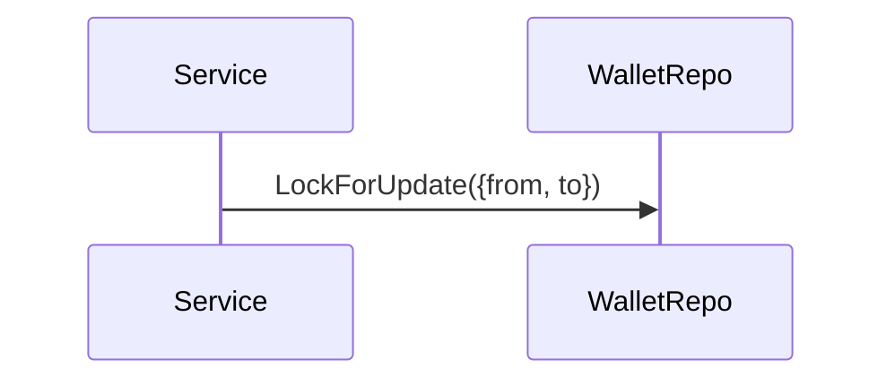
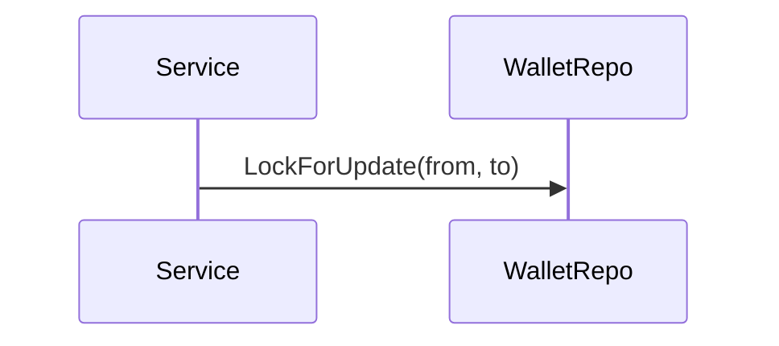
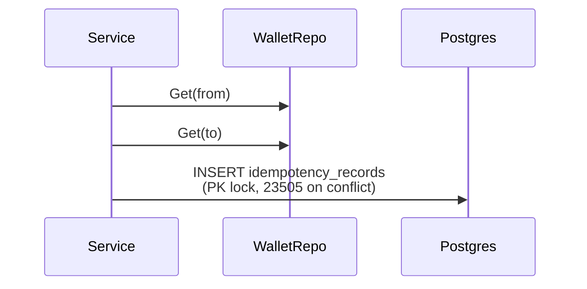
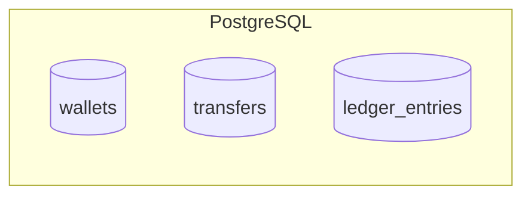
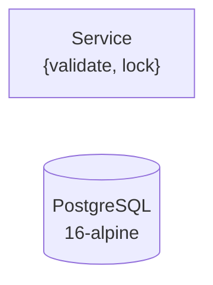

# Mermaid Diagrams That Render on GitHub But Pass `mmdc` Locally: The Four Traps

This is the post I wish I'd had three hours ago: every mermaid syntax that the GitHub renderer is stricter about than the official `mmdc` CLI, with before-and-after examples and a workflow that catches the failures before the PR ships.

The context: I shipped a README with 20 mermaid diagrams as part of a Go wallet-transfer service. Every diagram rendered cleanly under `npx @mermaid-js/mermaid-cli`. Three were blank on github.com. Two more rendered with the wrong shape. The fixes were one character each — but finding them took longer than writing the diagrams in the first place.

Repo: [github.com/PratikDhanave/wallet-transfer-assignment](https://github.com/PratikDhanave/wallet-transfer-assignment). All 20 diagrams render in the README on GitHub today.

## Why this happens at all

Mermaid is a markup language with a spec. Each renderer ships its own parser implementation. The parsers disagree on the edge cases. The official CLI (`@mermaid-js/mermaid-cli`, the one most teams use locally to validate diagrams) is the reference renderer; GitHub's renderer is its own implementation, more conservative on a handful of syntax patterns.

The result: a block that renders cleanly locally can silently fail on github.com. The silent part is the hard part. GitHub does not show a parse error — it shows a blank box, or a partially-rendered diagram with missing edges, or the wrong shape. You have to know what to look for.

There are at least four such patterns. There are probably more. These four are the ones I hit shipping a README with twenty diagrams.

## Trap 1: curly braces in sequence-diagram messages

**Broken:**



**Failure mode:** silent. GitHub renders the diagram without the offending message. The CLI renders it correctly. There is no error text anywhere.

**Fixed:**



**Why:** GitHub's mermaid parser treats `{...}` inside a sequence-diagram message text as an object literal and rejects the message rather than rendering it as a label. The CLI is more permissive and treats it as opaque text. Drop the braces — parens are safe, or rewrite to avoid grouping syntax entirely.

## Trap 2: semicolons inside parenthetical text

**Broken:**

```mermaid
sequenceDiagram
    participant S as Service
    participant W as WalletRepo
    participant DB as Postgres
    S->>W: Get(from); Get(to)
    S->>DB: INSERT idempotency_records<br/>(PK lock; 23505 on conflict)
```

**Failure mode:** visible. GitHub shows a partial diagram — the messages with semicolons are missing or truncated. The CLI renders everything.

**Fixed:**



**Why:** mermaid sequence diagrams use `;` as a message separator at the line level. Once you put a `;` anywhere on a message line — even inside parens, even inside a `<br/>`-bearing label — the parser sees two messages on one line, the first incomplete. GitHub's parser fails the whole message; the CLI's parser is more forgiving and tolerates it. Either split the message into two lines (clean, no semantic change) or swap the semicolon for a comma where the prose still reads naturally.

This was the trap that bit me hardest. The fix is mechanical but the cause is non-obvious — you don't expect a punctuation mark inside parens to be a parse-level separator.

## Trap 3: cylinder shape on a subgraph label

**Broken:**

```mermaid
flowchart LR
    subgraph DB [(PostgreSQL)]
        W[(wallets)]
        T[(transfers)]
        L[(ledger_entries)]
    end
```

**Failure mode:** visible. GitHub fails the whole diagram with a parser error. The CLI renders the subgraph with a malformed label that *looks* approximately right, which is why this one slips through local validation.

**Fixed:**



**Why:** the cylinder shape `[(...)]` is valid mermaid flowchart syntax for **nodes**. It is not valid for **subgraph labels** — the flowchart parser only accepts a plain bracketed label `subgraph DB[Label]` or a quoted label `subgraph DB["Label"]`. The cylinder nodes inside the subgraph still render as cylinders; the subgraph itself gets a plain box with a label, which is the correct visual treatment anyway.

If you genuinely want the subgraph to look like a database, the right move is to give the subgraph a plain label and let the cylinder-shaped nodes inside it carry the visual metaphor. That's the convention mermaid actually supports.

## Trap 4: unquoted node labels containing `{` or `<br/>`

**Broken:**

```mermaid
flowchart LR
    S[Service<br/>{validate, lock}]
    DB[(PostgreSQL<br/>16-alpine)]
```

**Failure mode:** varies. GitHub may render the label garbled, may render the wrong shape, or may fail the whole diagram depending on which special characters are present. The CLI is more lenient and usually renders something.

**Fixed:**



**Why:** mermaid documents an escape hatch for labels containing special characters: wrap the whole label in double quotes. Once quoted, the parser treats the contents as opaque label text and doesn't try to interpret `{`, `<br/>`, or other special characters as syntax. Make this the default for any label that isn't plain alphanumeric text — it's a one-character change per label and it works on every renderer.

## A workflow that catches all four

The shortest path to confidence is two passes:

**Pass 1 — `mmdc` for syntax errors.** Render every block locally. This catches the outright parser errors (Trap 3, when the syntax is invalid everywhere) and confirms the diagram is at least parseable somewhere.

```sh
# Extract each mermaid block to a .mmd file and render to SVG.
# Simplified shell — a real implementation walks README.md and pulls
# each ```mermaid block by index.
npx @mermaid-js/mermaid-cli -i diagram-01.mmd -o out/diagram-01.svg
```

**Pass 2 — github.com preview for the GitHub-only failures.** Push the branch (a draft PR works fine), open the README on github.com, and walk every diagram visually. The silent failures (Trap 1, Trap 2, Trap 4) only show up here.

The temptation is to skip pass 2 because pass 1 was clean. Don't. The four traps in this post all pass pass 1.

A useful scripted version of pass 1, for any repo with mermaid blocks in markdown files — keep it as a make target so it runs in CI:

```sh
#!/usr/bin/env bash
set -euo pipefail
# Extract every ```mermaid block from README.md and render each.
mkdir -p .tmp/mermaid
awk '
  /^```mermaid$/ {flag=1; idx++; out=sprintf(".tmp/mermaid/%02d.mmd", idx); next}
  /^```$/ && flag {flag=0; next}
  flag {print > out}
' README.md
for f in .tmp/mermaid/*.mmd; do
  echo "Validating $f"
  npx -y @mermaid-js/mermaid-cli -i "$f" -o "${f%.mmd}.svg" >/dev/null
done
echo "All mermaid blocks parse under mmdc."
echo "Now open the README on github.com and walk every diagram for blanks."
```

The script can't replace the second pass. The reminder at the end is part of the workflow.

## The broader lesson: renderers are not portable

The trap underneath all four traps is the assumption that "valid mermaid" is a single property. It isn't. There are multiple parsers in the wild, they disagree on edge cases, and the renderer in your distribution path is the one that matters.

This is not specific to mermaid. The same trap exists in:

- **Markdown.** GitHub-flavored markdown, CommonMark, MultiMarkdown, Pandoc-markdown — each accepts a different superset. Tables, footnotes, task lists, raw HTML — every one of those has a renderer that disagrees with another.
- **LaTeX.** A document that compiles under pdflatex may break under xelatex or lualatex, and Overleaf's renderer disagrees with TeXShop's on font handling.
- **HTML email.** The famous one. Gmail, Outlook, Apple Mail, and your designer's local browser are four different rendering targets.

The discipline is the same in all of these: identify your strictest renderer, build for it, and use the more permissive renderers as a faster local check. Never trust the local check alone.

For GitHub READMEs with mermaid diagrams: GitHub's renderer is the strictest one in your path. The CLI is the speed loop. The PR preview on github.com is the gate.

## What I'd do differently

In hindsight, the cheap discipline is to write every label quoted by default, never put a semicolon inside a sequence-diagram message, never put a brace inside a sequence-diagram message, and never try to put a shape on a subgraph header. Those four rules cover the four traps. They cost nothing in legibility — quoted labels render identically to unquoted ones — and they save the three hours I spent diffing render output between two browsers.

The full set of 20 working diagrams is in the README of the linked repo. Several of them were rewritten one or two characters at a time to land where they are. The git log around commits `9ac6b80` and `6ee5f4f` is the receipt — the commit messages enumerate exactly which trap fired for which diagram.

---

If you found this useful, follow for the next post in this series — on how to make GitHub Action workflows portable across the same kind of renderer-disagreement problem, but for shell quoting.

Repo: [github.com/PratikDhanave/wallet-transfer-assignment](https://github.com/PratikDhanave/wallet-transfer-assignment)
